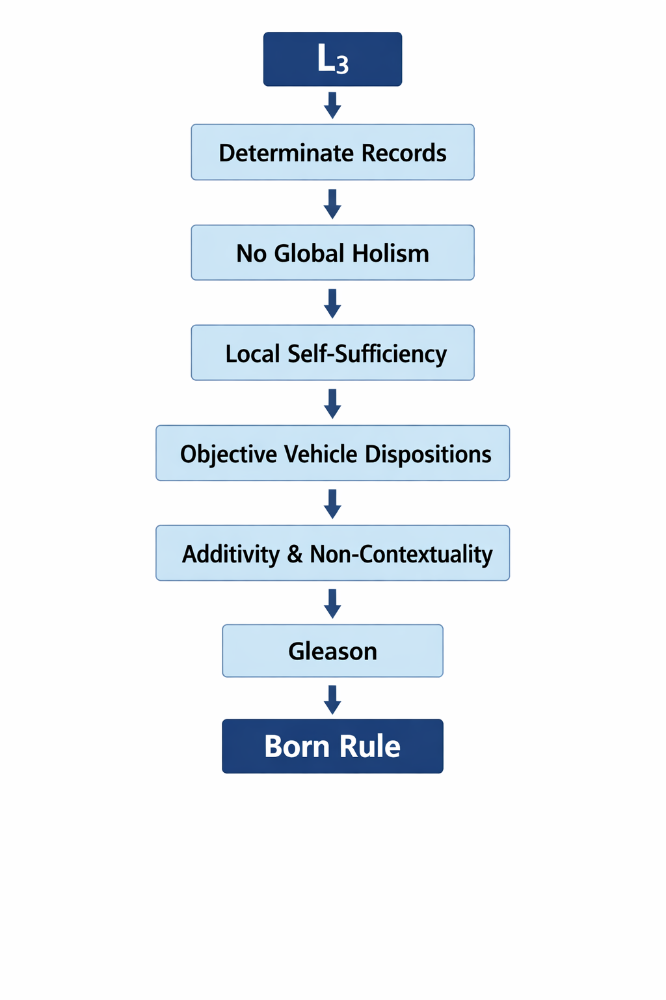

# Logic Realism Theory: Physical Foundations from Logical Constraints

**Position Paper – Version 1.0**

**James D. Longmire** 
Northrop Grumman Fellow (unaffiliated research) 
ORCID: 0009-0009-1383-7698 
Correspondence: jdlongmire@outlook.com

---

## Abstract

Logic Realism Theory (LRT) treats the three classical logical laws (Determinate Identity, Non-Contradiction, and Excluded Middle) as ontological constraints on physical instantiation, not merely rules of inference. The framework distinguishes $I_\infty$ (all representable configurations) from $A_\Omega$ (the $L_3$-admissible subset that can be physically instantiated as stable records). This boundary condition generates quantum structure: vehicle-invariance under mathematically equivalent decompositions forces the Born rule via Gleason's theorem; local tomography requirements select complex Hilbert space over real alternatives. The framework is falsifiable ($L_3$ violations in stable records would refute it) and progressive (it predicted complex QM before the Renou et al. 2021 test). Extensions to quantum field theory, general relativity, and cosmology are outlined. Full technical derivations appear in companion papers.

---

*Note: Views expressed are my own and do not represent those of Northrop Grumman Corporation.*

---

**Scope:** This position paper establishes the Logic Realism Theory framework and sketches the derivation of the Born rule from vehicle-invariance constraints. Full technical derivations appear in companion papers: *Complex Hilbert Space from Determinate Identity* (derives reconstruction axioms from Id), *Quantum Statistics from Determinate Identity* (derives symmetrization postulate). Extensions to quantum field theory, general relativity, and cosmology are outlined but not fully developed.

## 1. The Discovery

No stable experimental record, across the history of experimental science, has ever been documented as instantiating a direct violation of the classical laws of Identity, Non-Contradiction, or Excluded Middle. No detector record is both triggered and not triggered in the same respect. No logged outcome is both P and not-P in the same respect and at the same time. No measurement apparatus has yielded a contradiction at the level of actualized, stable records.

This pattern is not plausibly treated as a local artifact of one instrument class or one domain. It recurs across quantum experiments, particle physics, condensed matter, and astrophysics wherever results are registered as public records. Whatever we say about pre-measurement descriptions or quantum superposition, the level of actualized outcomes exhibits determinate, non-contradictory form.

Tahko (2009) defends the Law of Non-Contradiction as a metaphysical principle governing reality's structure rather than a semantic convention or psychological limitation. The present work extends this logic-realist position in two ways: first, it generalizes the stance to the full $L_3$ package (Identity, Non-Contradiction, and Excluded Middle jointly); second, it develops the structural consequences that follow when the $L_3$ is treated as an ontological constraint on physical instantiation rather than merely on abstract possibility.

**The track record matters.** $L_3$ is not an unexamined assumption. Philosophers have actively sought violations: Priest defends true contradictions, paraconsistent logics formalize contradiction-tolerance, quantum logic challenges distributivity, vagueness theorists probe borderline cases. These are not marginal efforts; they represent sustained, rigorous attempts to show that $L_3$ can fail. Human minds explore these violations fluently. Yet across a century of precision physics, no stable experimental record has ever instantiated one. The asymmetry is stark: representation permits what instantiation forbids. This asymmetry is the empirical foundation of Logic Realism Theory.

**Positioning.** LRT is "physics-first" in the sense that it starts from what any workable physical theory must deliver: stable, public records with determinate content. The claim is not that logic is an interpretive overlay on physics, but that $L_3$ admissibility is a boundary condition on physical instantiation. That boundary condition is operationally load-bearing: it restricts the space of viable state spaces, measures, and correlation structures, and it yields empirical discriminators rather than mere reinterpretations.

The discovery claim is modest but sharp: physics only proceeds because its public outputs are $L_3$ shaped. Logic Realism Theory treats this not as a human convention but as evidence that instantiation itself is constrained.[^1] The methodology is empirical (observe universal conformity of records) → structural (identify the constraint pattern) → derivational (determine what that pattern requires). The task is to develop what physics looks like under that constraint.

**It from Bit, Bit from Fit.** Wheeler's famous slogan "It from Bit" proposed that physical reality (It) emerges from information (Bit). LRT accepts this but goes one layer deeper: information itself requires a grounding. Bits exist because $L_3$ permits distinction; without Determinate Identity, there is no fact of the matter about whether something is 0 or 1. The complete slogan is therefore: *It from Bit, Bit from Fit*: physical structure (It) emerges from informational structure (Bit), which emerges from logical admissibility (Fit = $L_3$). This three-level picture distinguishes LRT from purely operational reconstruction programs: we derive not just "what mathematical structure fits the data" but "why that structure is the only one logic permits."

[^1]: "First philosophy applied to nature" here means: we make explicit the minimal structural constraints presupposed by experimental practice (stable records, determinate events, decomposition-invariant weighting), and then use those constraints to delimit admissible physical formalisms. This is not a substitution of metaphysics for physics. The output is model-restrictive and test-facing: it narrows the space of candidate theories and pushes specific mathematical consequences (state space, probability measure, correlation bounds) that can be checked against experiment.

### 1.1 The Core Distinction

The framework distinguishes two domains (defined formally in §2.1-2.3):

**$I_\infty$:** The space of all representable configurations: everything that can be specified, described, conceived, or formally expressed, without restriction to coherence or consistency. This includes contradictions, impossibilities, and violations of every logical principle. $I_\infty$ carries no ontological commitment; it is simply the totality of what representation permits.

**$A_\Omega$:** The constraint-class of configurations that satisfy the Three Fundamental Laws of Logic ($L_3$: Identity, Non-Contradiction, and Excluded Middle). These are the configurations that can be physically instantiated as stable records.

The relationship between them is the foundation of Logic Realism Theory.

### 1.2 The Research Program

If the $L_3$ constrains which configurations can be instantiated, what follows for the structure of physics? What constraints does the $L_3$ place on admissible physical theories, measurable quantities, and dynamical evolution? What can we derive from the $L_3$ rather than postulate empirically?

The answers turn out to be substantial. Key structural features of quantum mechanics (most centrally the Born rule and the admissible form of nonlocal correlations) follow from applying the $L_3$ rigorously to physical systems, with full derivations developed in companion work. These are not independent empirical facts about quantum mechanics but consequences of the requirement that physical records satisfy Identity (Id).

This introduction presents the Logic Realism Theory framework and demonstrates its scope. Section 2 develops the formal structure: $I_\infty$, $A_\Omega$, and the $L_3$ as admissibility condition. Section 3 establishes the vehicle/content distinction and its role in quantum mechanics. Section 4 sketches the derivation of quantum structure from the $L_3$, with full technical details in companion papers. Section 5 addresses objections. Section 6 outlines the research program extending LRT to quantum field theory, general relativity, and cosmology. Section 7 concludes.

The goal is not to argue for Logic Realism Theory as one interpretation among others but to show that it generates a productive research program with testable consequences. If the $L_3$ constrains instantiation, physics has logical foundations. The aim here is to show what follows if that constraint is treated as real and load-bearing rather than as a mere feature of language.

Before proceeding to technical development, it is worth clarifying LRT's status within the philosophy of science frameworks that distinguish genuine scientific programs from metaphysical speculation.

### 1.3 Scientific Status: Popper and Lakatos

**Popperian falsifiability.** Logic Realism Theory satisfies Popper's demarcation criterion: it makes risky predictions that could be empirically refuted. The framework predicts that (1) all stable records are $L_3$ admissible, (2) probability measures are vehicle-invariant, (3) complex QM is required for local tomography, and (4) objective collapse parameters (if they exist) are derivable from fundamental constants. Each prediction specifies conditions under which LRT would be falsified, not merely adjusted. A single stable record instantiating a direct $L_3$ violation (say, a detector simultaneously registering "triggered" and "not triggered" in the same respect) would refute the core thesis.

The framework is not unfalsifiable. It takes empirical risk.

**Lakatosian research program.** Lakatos distinguished progressive from degenerating research programs by their ability to predict novel facts. LRT qualifies as progressive on three counts:

**Hard core:** The $L_3$ (Identity, Non-Contradiction, Excluded Middle) as constraints on physical instantiation. This is non-negotiable; abandoning it would abandon the program.

**Protective belt:** Specific implementations (vehicle-invariance formulation, Hilbert space representation, interface criterion) are negotiable. These can be refined, replaced, or extended without abandoning the hard core.

**Progressive predictions:** Reconstruction theorems (Hardy, 2001; Masanes & Müller, 2011) establish local tomography as a foundational axiom constraining field choice. Building on this, LRT predicted complex QM over real alternatives before Renou et al. (2021) designed the experimental test. The framework predicts derivability constraints on collapse parameters before such experiments are performed. It predicts correlation bounds (Tsirelson not PR-box) and information preservation (unitary black hole evaporation) in advance of decisive experimental confirmation. These are novel predictions, not post-hoc accommodations.

**Comparison to rivals:** Copenhagen is not falsifiable (refuses ontological commitment). Many-Worlds makes no novel predictions (empirically equivalent to standard QM). Bohmian mechanics makes no predictions beyond standard QM. GRW makes novel predictions (collapse parameters) but does not derive them from a hard core. Only LRT combines a non-empirical hard core (logical constraints) with empirically testable protective belt (specific mathematical structures).

**One-world realism.** LRT shares structural features with Many-Worlds (Everett): quantum states evolve unitarily, branching structure is real, decoherence explains apparent classicality. But LRT differs fundamentally in ontology. In Many-Worlds, all branches are equally instantiated: the universe continually splits into coexisting worlds. In LRT, branching structure exists in $I_\infty$ (the representational space), but only *one* $L_3$-admissible outcome history is ever instantiated in $A_\Omega$. The Born rule weights don't describe "how much" of reality each branch gets; they describe the objective disposition of a single world toward its possible futures. This is one-world realism with Everettian structure: the mathematics of branching without the ontology of multiplication.

**Formal compatibility.** LRT adopts essentially all of the formalism of standard complex-Hilbert-space quantum mechanics, the same mathematical machinery used by Many-Worlds, Copenhagen, and textbook QM. The Hilbert space derivation (companion paper) shows that Id forces the Masanes-Müller axioms, yielding the standard arena: pure states, tensor products, unitaries, Born-rule probabilities. LRT is therefore compatible with Bohmian-style or collapse-style additions at the vehicle layer, provided they respect the $L_3$-admissibility constraint on records. The formalism is shared; the grounding is LRT-specific. This is the value proposition: inherit all the mathematical machinery of quantum mechanics while placing a logic-driven constraint on how that formalism hooks onto reality. LRT constrains *which* formalisms are admissible, not how to build them from scratch.

**Empirical progressiveness:** A research program is progressive if it predicts novel facts that are later confirmed. LRT's complex-QM requirement (from local tomography) preceded the experimental design distinguishing complex from real QM. If future experiments confirm derivable collapse parameters or observe Tsirelson-bound saturation in new regimes, the program gains progressive character. If experiments falsify these predictions, the hard core requires revision or abandonment.

This is not metaphysics disguised as physics. It is a scientific research program with a non-empirical hard core (logical constraints) that generates empirically testable consequences (correlation bounds, field selection, collapse constraints). Lakatos would classify it as progressive if the protective belt continues generating confirmed novel predictions. Popper would approve of its falsifiability.

---

## Commitments, Non-Commitments, and Falsifiers

**What LRT commits to:**

- Stable public records are $L_3$ admissible (satisfy Identity, Non-Contradiction, and Excluded Middle jointly).
- This constraint is ontological (about what can be instantiated), not merely semantic (about how we describe things).
- Outcome-measure must be invariant under mathematically equivalent decompositions (different ways of describing the same event cannot assign different total weights).
- The representational vehicle (quantum state) encodes outcome-possibility structure determinately, even when outcomes themselves are not yet sharp.

**What LRT does not commit to:**

- No commitment to collapse as a physical mechanism. "Actualization" is category-transition (representable → instantiated), not a dynamical process requiring new physics.
- No commitment that state vectors are ontologically fundamental entities "out there" as Platonic objects. They are representational vehicles within the theory.
- No denial that alternative ontologies (Bohmian, Many-Worlds, etc.) exist. The claim is that any empirically adequate theory must respect the constraint that stable records belong to $A_\Omega$.
- No claim that $L_3$ constraints derive all of physics. Specific field content, coupling constants, and initial conditions remain empirical inputs.

**Falsification criteria (examples):**

- A stable, reproducible public record instantiating a direct $L_3$ violation (e.g., detector output simultaneously registering "triggered" and "not triggered" in the same respect).
- A consistent, repeatable measurement scenario where mathematically equivalent decompositions of the same event yield systematically different total probability weights (violating vehicle-invariance).
- An experimental realization of the Renou et al. (2021) network scenario that violates the real-quantum-theory bound, which would support complex QM over real-Hilbert-space QM and confirm LRT's local tomography requirement.
- Empirical confirmation of objective collapse with free parameters that cannot be derived from fundamental constants (violating the parsimony requirement).

---

## 2. The Framework: Formal Development

### 2.1 The Space of Representable Configurations

$I_\infty$ is not a domain of entities. It carries no ontological commitment. It is the totality of what can be specified, described, or conceived, including configurations that violate every logical principle.

**Examples of elements in $I_\infty$:**

- Consistent configurations: "electron with spin up"
- Inconsistent configurations: "electron with spin both up and down in the same basis"
- Impossible configurations: "round square," "married bachelor"
- Formally specified contradictions: paraconsistent theorems, dialetheia
- Vague specifications: "somewhat round square"
- Indeterminate specifications: "object without determinate identity"

The last example is crucial. $I_\infty$ includes configurations that violate Determinate Identity itself, configurations specified as lacking determinate identity. These are representable (we just represented one) but not instantiable.

$I_\infty$ is closed under representation operations:

- **Negation:** If configuration $c \in I_\infty$, then "not-$c$" $\in I_\infty$
- **Conjunction:** If $c_1, c_2 \in I_\infty$, then "$c_1$ and $c_2$" $\in I_\infty$ (even if contradictory)
- **Disjunction:** If $c_1, c_2 \in I_\infty$, then "$c_1$ or $c_2$" $\in I_\infty$
- **Quantification:** Universal and existential quantification over $I_\infty$ elements

This closure property ensures $I_\infty$ contains every representational construction, including those that build contradictions from consistent elements.

### 2.2 The Three Fundamental Laws as Ontological Constraints

The $L_3$ comprises three classical logical principles, understood here as constraints on instantiation rather than constraints on inference or description:

**Determinate Identity (Id):** Every instantiated configuration is determinately what it is, independent of description or decomposition. For any admissible ways of describing or decomposing configuration $i \in A_\Omega$, they all pick out the same $i$. Formally, this is the requirement that identity is invariant under admissible redescription:

$$\text{For any descriptions } d, d' \text{ of the same configuration: } d(i) = d'(i) = i$$

This is not the trivial claim that identity is reflexive ($i = i$). It is the substantive claim that instantiated configurations have determinate identity: they are self-identical in a way that does not depend on how they are described, measured, or decomposed. A configuration without determinate identity is not vague or indeterminate; it fails to be a configuration at all.

**Non-Contradiction (NC):** No instantiated configuration simultaneously possesses and lacks a property in the same respect. For any well-defined property $P$ and configuration $i \in A_\Omega$:

$$\neg(P(i) \land \neg P(i))$$

The "in the same respect" qualification is essential. An electron can have spin-up relative to the z-axis and spin-down relative to a rotated axis. But it cannot have spin-up *and* spin-down relative to the same measurement basis.

**Excluded Middle (EM):** For any well-defined property $P$ applicable to an instantiated configuration $i \in A_\Omega$, either $i$ possesses $P$ or $i$ lacks $P$:

$$P(i) \lor \neg P(i)$$

Here EM is a constraint on instantiation for sharply specified properties, not a claim about what an agent can know or prove. The law applies to instantiated configurations with respect to well-defined properties, properties that have determinate applicability conditions. It does not require that we know which disjunct holds, only that exactly one does hold.

These three laws are not independent. They are three aspects of determinacy: a configuration is determinate when it is self-identical (Id), possesses no contradictory properties (NC), and has definite status with respect to all applicable properties (EM). Together they define what it means for a configuration to be instantiable.

### 2.3 The Admissibility Condition

**Definition.** Let $A_\Omega$ be the constraint-class of $L_3$ admissible configurations in $I_\infty$. Define:

$$L_3(i) := \text{Id}(i) \land \text{NC}(i) \land \text{EM}(i)$$

Then:

$$A_\Omega := \{ i \in I_\infty : L_3(i) \}$$

where Id is Determinate Identity, NC is Non-Contradiction, and EM is Excluded Middle. A configuration here is a candidate state-description in $I_\infty$. An instantiated configuration is one that satisfies the $L_3$ constraints (belongs to the constraint-class $A_\Omega$).

**Empirical claim.** All stable physical records appear to fall within $A_\Omega$. No experimental record has been documented as belonging to $I_\infty$ \ $A_\Omega$. For avoidance of doubt: this is a claim about stable, public records, not about all internal theoretical descriptions or counterfactual propositions.

**Substantive thesis.** Defining $A_\Omega$ does not explain why the physical world is confined to it. The definition specifies the constraint-class. The substantive claim is that this confinement is not contingent (a lucky regularity) and not merely methodological (an artifact of how we measure), but rooted in what it is to be physically instantiated. Logic Realism Theory is the claim that instantiation itself is governed by the $L_3$. The research program asks what physics looks like under that constraint.

To ask why reality does not instantiate $L_3$-violating records is to ask why physics has stable public outcomes at all. LRT's proposal is that "being instantiated as a record" and "being $L_3$ admissible" pick out the same boundary.

The $L_3$ functions as an admissibility condition on $I_\infty$. The term "filter" is informal shorthand for this admissibility requirement, not a mechanism operating within physics but the boundary condition between representable and instantiable.

**Key properties of the admissibility condition:**

1. **Idempotence:** Applying the $L_3$ condition twice yields nothing new. Configurations already in $A_\Omega$ remain there.

2. **Monotonicity:** If $S_1 \subseteq S_2 \subseteq I_\infty$, then the $L_3$-admissible subset of $S_1$ is contained in the $L_3$-admissible subset of $S_2$. The condition preserves subset relations.

3. **Non-surjectivity:** There is no operation mapping $A_\Omega$ back onto all of $I_\infty$. Once the admissibility condition is applied, inadmissible configurations cannot be recovered.

4. **Composition:** For configurations $c_1, c_2 \in A_\Omega$, their conjunction is admissible only if it satisfies the $L_3$. This is not automatic; jointly inadmissible configurations exist (§2.4).

### 2.4 Joint Inadmissibility and Temporal Ordering

Two individually admissible configurations may be jointly inadmissible. Let $c_1, c_2 \in A_\Omega$ be configurations such that:

$$c_1 \land c_2 \notin A_\Omega$$

This occurs when the conjunction violates NC or EM. For example, "particle at position $x_1$" and "particle at position $x_2 \neq x_1$" are individually admissible but jointly inadmissible for the same particle at the same time.

Joint inadmissibility generates temporal ordering. If $c_1$ and $c_2$ cannot be co-instantiated but can be sequentially instantiated, time emerges as the ordering structure that separates jointly inadmissible configurations.

**Definition (Temporal Ordering):** Configurations $c_1, c_2 \in A_\Omega$ stand in temporal relation "$c_1$ before $c_2$" if:

1. $c_1 \land c_2 \notin A_\Omega$ (jointly inadmissible)
2. Both $c_1$ and $c_2$ are instantiated
3. $c_1$ instantiates, then ceases, then $c_2$ instantiates

Time is not geometry. Time is the logical sequencing necessitated by joint inadmissibility of individually admissible configurations.

**Scope limitation:** This is not yet a derivation of Lorentzian time or metric structure. It is a proposal about why an ordering parameter is forced when jointly inadmissible configurations are sequentially realized. Spacetime geometry is treated later as additional structure built on top of that ordering.

### 2.5 Why This Framework Is Not Operationalism

The framework distinguishes representable from instantiable, but this is not operationalism (the view that only observable quantities are meaningful). Three differences:

**First, ontological commitment.** Operationalism avoids commitment to what exists beyond observations. LRT makes structural claims: $A_\Omega$ specifies the constraint-class of $L_3$-admissible configurations. Stable records fall within this class. This is realism about constraints, not instrumentalism.

**Second, independence from observers.** Operationalism ties physical quantities to measurement procedures, making them observer-dependent. LRT treats the $L_3$ as observer-independent constraints on instantiation. Measurements reveal which configurations are instantiated; they do not create those configurations.

**Third, derivational power.** Operationalism organizes observations without deriving structure. LRT derives quantum structure (Born rule, Hilbert space, measurement postulates) from logical constraints. The framework explains why certain observational patterns hold rather than merely cataloging them.

The framework is logic realism, not operationalism. It is realist about constraint structure, treats the $L_3$ as mind-independent, and generates derivations rather than taxonomies.

---

## 3. Vehicle/Content and Quantum Mechanics

### 3.1 Quantum States as Representational Vehicles

Having distinguished representable content from instantiated records (§2), we now apply the same vehicle/content split to quantum theory: the state vector functions as a representational vehicle that encodes a structured space of outcome-possibilities, while measurement records are the instantiated outputs constrained by the $L_3$.

The vehicle/content distinction explains why minds can represent what reality cannot instantiate: the representing is always $L_3$ admissible, even when the represented is not. The same distinction explains quantum superposition without paradox.

### 3.2 The Asymmetry as Evidence

This vehicle/content distinction generates a testable asymmetry. If the $L_3$ constrained only representation (as psychologism claims), then:

- Representing violations should be difficult or impossible (since vehicles must satisfy the $L_3$)
- Instantiating violations should be possible (since reality would be unconstrained)

If the $L_3$ constrains only instantiation (as logic realism claims), then:

- Representing violations should be possible (vehicles satisfy the $L_3$ while contents need not)
- Instantiating violations should be impossible ($A_\Omega$ is defined by $L_3$ satisfaction)

The empirical record supports the second pattern. Conceiving contradictions is cognitively trivial; instantiating them has never been observed. This asymmetry (representation permits what instantiation forbids) is the empirical foundation introduced in §1.

The point is not merely that we have never observed violations. It is that the pattern of what we can represent versus what we can instantiate matches the logic-realist prediction rather than the psychologist or descriptivist prediction. If the $L_3$ were merely "how we think," we could not think violations. If the $L_3$ were merely "how we talk," we could stipulate alternative conventions. But we can think violations, reality never instantiates them, and no stipulation changes this. The constraint is on $A_\Omega$, not on $I_\infty$.

### 3.3 Superposition as Representational Vehicle

The vehicle/content distinction becomes essential when analyzing quantum mechanics. A quantum state |ψ⟩ is not a direct description of an instantiated configuration but a representational vehicle encoding outcome-possibilities.

Consider the paradigm case: a qubit in superposition

$$|\psi\rangle = \frac{1}{\sqrt{2}}(|0\rangle + |1\rangle)$$

This state is a well-defined mathematical object within the theory. The state vector is a precise representational vehicle that can be manipulated without contradiction. Whatever physical substrate realizes the situation, the representation is determinate as a vehicle: it is the specific superposition with coefficients (1/√2, 1/√2), with definite inner products with other states, with determinate evolution under unitary operators.

The content (what the vehicle represents about outcome-possibilities) concerns what will happen when measurement in the {|0⟩, |1⟩} basis occurs. The state does not describe a configuration that both has and lacks a definite value (NC violation), nor does it describe a configuration outside the true/false dichotomy (EM violation). It describes a physical situation such that when measurement occurs, exactly one outcome will be recorded, and that record will be $L_3$ admissible.

### 3.4 What Superposition Represents

The critical question: what does superposition represent in the LRT framework?

**Not a contradiction.** The state α|0⟩ + β|1⟩ does not represent a configuration that is both "definitely 0" and "definitely 1." It represents a physical situation that is not yet determinate with respect to the sharp property "has definite value 0 or 1 in this basis."

**Not vagueness.** The state is not a vague or imprecise specification of "either 0 or 1 but we don't know which." The superposition has definite mathematical structure: specific coefficients, definite phase relations, determinate inner products with other states. It is precisely what it is as a representational vehicle.

**Admissible structure poised toward outcomes.** The superposition represents a physical situation whose public records, when produced in that measurement context, are always $L_3$ admissible and mutually exclusive. The state encodes how the physical situation is disposed toward those outcomes via the Born rule probabilities.

This last interpretation is key. The quantum state is a well-defined representational vehicle in the theory that encodes outcome-possibilities: specifically, it encodes the probability distribution over $L_3$-admissible outcomes that will be produced when measurement occurs.

### 3.5 Measurement Contexts and Sharp Properties

The measurement basis determines which properties are sharp. For state |ψ⟩ = α|0⟩ + β|1⟩:

- **Property $P_1$:** "has value 0 in computational basis," not sharp for |ψ⟩ prior to measurement
- **Property $P_2$:** "corresponds to state vector |ψ⟩ in Hilbert space," sharp for the representational vehicle
- **Property $P_3$:** "would yield outcome 0 with probability |α|² upon computational basis measurement," sharp for the representational vehicle

The third property is crucial. The quantum state determinately possesses the property "encodes probability |α|² for outcome 0." This probability is not epistemological uncertainty about a pre-existing value; it is a determinate feature of how the representational vehicle characterizes the physical situation.

When we say measurement "actualizes" an outcome, we mean: the physical situation transitions to a configuration that produces a stable record displaying a sharp property assignment. The record is $L_3$ admissible. The transition is from a situation represented by a superposition (vehicle encoding outcome-possibilities) to a situation represented by a definite eigenstate (vehicle encoding sharp property assignment).

### 3.6 Why This Is Not "Collapse by Definition"

A natural objection: "You've defined measurement as producing determinate outcomes, so of course outcomes are determinate. This is circular."

The response has two parts.

**First, the definitional move is legitimate.** We define $A_\Omega$ as configurations satisfying $L_3$, then observe that experimental records always belong to $A_\Omega$. The substantive claim is not that we *chose* to make outcomes determinate but that the physical world *confines* records to $A_\Omega$. The definition identifies the constraint-class; the empirical fact is that the constraint holds.

**Second, the Born rule is not definitional.** Given that outcomes must be determinate (must belong to $A_\Omega$ as stable records), the question remains: what probability measure governs which outcome actualizes? Here the vehicle/content distinction generates a non-trivial constraint.

If a single physical situation admits multiple mathematically equivalent decompositions into outcome-projectors, Id forbids the total weight assigned to that situation from depending on the chosen decomposition. Equivalence here means: decompositions that correspond to the same projector/ray structure (same event) and differ only by basis choice or refinement/coarse-graining that preserves the event. The representational vehicle must characterize the situation determinately, which means the measure it encodes cannot vary with representational choices. Therefore the weight function on projectors must be additive across orthogonal resolutions and non-contextual across embeddings.

This requirement (that measure is vehicle-invariant under mathematically equivalent decompositions) generates the additivity and non-contextuality conditions that Gleason's theorem requires. The Born rule |⟨φ|ψ⟩|² emerges as the unique measure satisfying these constraints.

Section 4 develops this derivation. The point here is that the vehicle/content distinction does real work: it separates "outcomes must be determinate" (from $A_\Omega$ definition) from "probabilities take form |ψ|²" (from vehicle-invariance under decomposition).

### 3.7 Entanglement and Non-Local Correlations

Entangled states present a case where the vehicle/content distinction clarifies non-locality.

Consider the Bell state:

$$|\Phi^+\rangle = \frac{1}{\sqrt{2}}(|00\rangle + |11\rangle)$$

This is a single representational vehicle encoding a two-particle configuration. The vehicle is well-defined in the theory: it is determinately the state |Φ⁺⟩, with definite coefficients and inner products. What it represents is a physical situation where neither particle's outcome is sharp relative to measurement basis prior to measurement, yet the outcomes will be perfectly correlated.

The key insight: the representational vehicle is non-local. It cannot be factorized into separate vehicles for particles A and B. The physical situation is represented as a unified configuration spanning both locations. When measurement occurs at one location, the global vehicle transitions to a new global vehicle representing a configuration where both particles now produce correlated sharp records.

This is not action at a distance within the physical situation itself. The vehicle was already global; measurement reveals which of the globally-correlated outcomes actualizes. The correlation is encoded in the vehicle structure prior to measurement.

Bell inequality violations demonstrate that no local hidden variable account can reproduce these correlations. Within LRT, any hidden-variable completion compatible with Bell must either be nonlocal or contextual. LRT predicts that outcome-structure is globally constrained at the level the vehicle encodes.

The appearance of faster-than-light influence dissolves when we recognize that:
1. The representational vehicle is global (not two separate local vehicles)
2. Measurement transitions the global vehicle to a new global vehicle
3. Both vehicles encode $L_3$-admissible outcome structures
4. No information propagates because the correlation was already present in the vehicle's encoding

### 3.8 Summary: Layered Representation

The picture that emerges has three layers:

**Layer 1: Representable configurations ($I_\infty$)**  
All specifications, including contradictions and impossibilities. No constraint.

**Layer 2: Quantum states as representational vehicles in the theory**  
Well-defined Hilbert space vectors. These are $L_3$-consistent descriptions within the mathematical formalism. They encode outcome-possibilities via probability distributions, but they are not themselves "instantiated records" in the sense of experimental outputs.

**Layer 3: Measurement outcomes as instantiated records**  
Sharp property assignments in stable, public records. These are the $L_3$-admissible configurations that experimental records display. Determinately 0 or 1, spin-up or spin-down, etc. Only this layer is directly instantiated as public record.

Layer 2 is the theory's vehicle for representing how Layer 3 distributions arise from physical situations. The vehicle/content distinction operates at each level:
- Mind states (vehicles satisfying the $L_3$) represent impossible configurations (content in $I_\infty$)
- Quantum states (vehicles in mathematical formalism) represent outcome-possibility structures (content pointing toward Layer 3 records)
- Measurement outcomes (instantiated records) represent physical properties (content as property assignments)

The framework is realist about all three layers in different senses: $I_\infty$ exists as the space of representational possibility, quantum states exist as well-defined vehicles within our best theory, and measurement outcomes exist as actual instantiated records in $A_\Omega$.

This sets up the Born rule derivation: if quantum states are representational vehicles that encode outcome-possibilities via probability distributions, and these vehicles must characterize physical situations determinately (Id), then the probability measure must be invariant under mathematically equivalent decompositions. Section 4 makes this precise.

---

## 4. From Vehicle-Invariance to the Born Rule

### 4.1 The Derivation Strategy

The Born rule states that the probability of measuring outcome φ given state ψ is:

$$P(\phi|\psi) = |\langle\phi|\psi\rangle|^2$$

This is not postulated in LRT but derived from the requirement that representational vehicles characterize physical situations determinately. The derivation proceeds in four steps:

1. **Vehicle-invariance requirement:** Id (Determinate Identity) applied to representational vehicles
2. **Measure structure:** Vehicle-invariance generates additivity and non-contextuality constraints
3. **Gleason's theorem:** These constraints uniquely determine the measure form
4. **Born rule:** The |ψ|² form emerges as the unique solution

This section sketches the derivation. Full technical details, including rigorous proofs and treatment of edge cases, appear in the companion Born rule paper (Longmire, forthcoming).

### 4.2 Vehicle-Invariance: The Core Requirement

A quantum state |ψ⟩ is a representational vehicle encoding outcome-possibilities for measurement contexts. For any measurement context M with possible outcomes {$\phi_i$}, the state assigns probabilities:

$$P(\phi_i|\psi) = \text{some function of } |\psi\rangle \text{ and } |\phi_i\rangle$$

The question: what constrains this probability assignment?

**Key insight:** A single physical situation can be described using different bases, different decompositions, different mathematical representations, all equivalent in the sense that they describe the same measurement event. Vehicle-invariance is the requirement that these equivalent descriptions assign the same total probability weight to the event.

**Equivalence class specification:** An event E is identified with a projector P_E onto a subspace. Two descriptions d and d′ are equivalent for event E if they use different orthonormal resolutions (bases) but both contain the same projector P_E. For example, measuring "spin-up along z-axis" is the same event whether we embed it in the {z-up, z-down} basis or decompose that basis in terms of {x-up, x-down}.

**Formal statement:** Let E be a measurement event (identified with projector P_E). If descriptions d and d′ both represent E using different orthonormal bases or decompositions, then:

$$P_d(E|\psi) = P_{d'}(E|\psi)$$

The probability assigned to E cannot depend on which mathematically equivalent description we use. As Peres (1993, §6.3) emphasizes, probability assignments to projectors must be basis-independent when the projectors themselves are identical.

This is not a physical assumption about measurement apparatus. It is a logical requirement from Id: if the representational vehicle determinately characterizes the physical situation, then probability assignments that vary with mere representational choice would violate that determinacy. The vehicle would fail to pick out a determinate probability structure.

### 4.3 From Vehicle-Invariance to Additivity

Vehicle-invariance immediately generates the additivity constraint.

Consider a measurement with outcomes {$\phi_1$, $\phi_2$, $\phi_3$}. We can describe the event "outcome is $\phi_1$ or $\phi_2$" in two equivalent ways:

**Description 1:** Treat the event as a single composite outcome E = {$\phi_1$, $\phi_2$}.

**Description 2:** Treat the event as the disjunction of two separate outcomes $\phi_1$ and $\phi_2$.

Vehicle-invariance requires these assign the same probability:

$$P(E|\psi) = P(\phi_1|\psi) + P(\phi_2|\psi)$$

This is additivity: the probability of a disjoint union of outcomes equals the sum of individual probabilities.

**Key point:** Additivity is not assumed as a probability axiom. It is derived from vehicle-invariance. The representational vehicle must assign the same weight to an event regardless of whether we describe it as "composite outcome E" or "$\phi_1$ or $\phi_2$."

### 4.4 From Vehicle-Invariance to Non-Contextuality

Vehicle-invariance also generates non-contextuality of the probability measure.

Consider a two-dimensional system (qubit). We can measure in the computational basis {|0⟩, |1⟩} or in the Hadamard basis {|+⟩, |−⟩}. Both are valid measurement contexts for the same system.

Now consider a specific outcome, the projector $P_0$ = |0⟩⟨0|. This projector can be expressed in multiple bases:

$$P_0 = |0\rangle\langle 0| = \frac{1}{2}(|+\rangle\langle +| + |-\rangle\langle -|) + \frac{1}{2}(|+\rangle\langle -| + |-\rangle\langle +|)$$

This expression illustrates that the same projector can be represented within different orthonormal resolutions; the probability assignment must track the projector itself, not the basis-dependent expansion. Both expressions represent the same measurement event.

Vehicle-invariance requires:

$$P(P_0|\psi) = \text{same value regardless of which basis decomposition we use}$$

This is non-contextuality: the probability assigned to a projector cannot depend on which other projectors it is measured alongside (which basis embeds it).

**Crucial distinction:** We are not claiming that measurement outcomes are non-contextual in the sense that values pre-exist. We are claiming that the *probability measure* over outcomes must be non-contextual in the sense that projector weights don't vary with basis choice. The Kochen-Specker theorem (Kochen & Specker, 1967) concerns value assignment; this concerns measure assignment. These are compatible.

### 4.5 Gleason's Theorem

We now have two constraints derived from vehicle-invariance:

1. **Additivity:** For disjoint outcomes, P($E_1$ ∪ $E_2$) = P($E_1$) + P($E_2$)
2. **Non-contextuality:** Projector weights independent of basis embedding

Gleason's theorem (1957) proves that in Hilbert spaces of dimension ≥ 3, any probability measure satisfying these two constraints must have the form:

$$P(P_\phi|\psi) = \text{Tr}(\rho P_\phi)$$

where ρ is a density operator and Pφ is the projector onto outcome φ.

For pure states, ρ = |ψ⟩⟨ψ|, giving:

$$P(P_\phi|\psi) = \text{Tr}(|\psi\rangle\langle\psi| \cdot |\phi\rangle\langle\phi|) = |\langle\phi|\psi\rangle|^2$$

This is the Born rule. The |ψ|² form is the unique probability measure satisfying the constraints that vehicle-invariance imposes.

**What Gleason's theorem does:** It proves uniqueness. Given additivity and non-contextuality, the Born rule is the only possibility (in dimension ≥ 3).

**What LRT contributes:** The justification for additivity and non-contextuality. These are not independent probability axioms but consequences of Id (Determinate Identity) applied to representational vehicles. The Born rule is derived, not postulated.

### 4.6 The Dimension-2 Case

Gleason's theorem requires dimension ≥ 3. For qubits (dimension 2), the theorem does not apply directly. This is not a gap but a feature: the two-dimensional case requires separate treatment.

For qubits, the Born rule can be derived using:

1. **Symmetry constraints:** Rotational invariance on the Bloch sphere
2. **Continuity:** Small changes in state produce small changes in probabilities
3. **Extremality:** Pure states are extremal points of the probability simplex

These constraints, combined with vehicle-invariance, uniquely determine the |ψ|² form for dimension 2. The derivation is more involved than Gleason but reaches the same conclusion.

**Full treatment:** The companion Born rule paper develops the dimension-2 case rigorously, showing that vehicle-invariance plus standard geometric constraints yields the Born rule for all finite dimensions.

### 4.7 Physical Interpretation

The Born rule derivation reveals its physical meaning. The rule is not an independent postulate about measurement but a consequence of requiring that:

1. **Quantum states are determinate vehicles** (Id applied to representation)
2. **Vehicles encode probability structure** (outcomes are $L_3$ admissible but which actualizes is probabilistic)
3. **Probability assignments are vehicle-invariant** (don't vary with representational choice)

The |⟨φ|ψ⟩|² form emerges as the unique way to assign probabilities that respects these requirements.

**Why the squared magnitude?** Three reasons:

**First, from inner product structure.** The Born rule uses the inner product ⟨φ|ψ⟩, which encodes distinguishability structure (technical companion, §3.3). The squared magnitude |⟨φ|ψ⟩|² converts distinguishability (which can be negative/complex-valued) into probability (which must be real and non-negative).

**Second, from normalization.** For state ψ expanded in basis {$\phi_i$}:
$$|\psi\rangle = \sum_i c_i |\phi_i\rangle$$
Normalization requires ⟨ψ|ψ⟩ = 1, giving $\Sigma_i$|$c_i$|² = 1. This matches probability normalization $\Sigma_i$P($\phi_i$|ψ) = 1 precisely when P($\phi_i$|ψ) = |$c_i$|².

**Third, from Gleason's uniqueness.** Given additivity and non-contextuality, the exponent 2 is not chosen but forced. Any other exponent would violate one of these constraints.

The Born rule is not a brute fact about quantum mechanics but the unique probability measure compatible with vehicle-invariance in Hilbert space.

### 4.8 What This Derivation Achieves

The LRT derivation of the Born rule accomplishes three things:

**First, reduces postulates.** Standard quantum mechanics postulates the Born rule independently. LRT derives it from Id (Determinate Identity) applied to representational vehicles. One fewer independent axiom.

**Second, explains the form.** Why |ψ|² rather than |ψ|, |ψ|³, or some other function? The derivation shows: because |ψ|² is the unique form satisfying vehicle-invariance constraints. The form is not arbitrary.

**Third, connects logic to measurement.** The Born rule is the bridge between logical constraints ($L_3$ admissibility of outcomes) and empirical statistics (frequencies of measurement results). The derivation shows this bridge is not conventional but forced by Id.

**Scope limitation:** This derivation assumes Hilbert space structure. The companion technical paper shows that Hilbert space itself follows from distinguishability plus continuity plus local tomography. The complete derivation chain is:

$$\text{$L_3$} \to \text{Hilbert space} \to \text{Born rule} \to \text{measurement statistics}$$

Each arrow is a derivation, not a postulate. The framework is closed: it generates its own measurement predictions from logical constraints.

{width=60%}

**Figure 1.** The derivation chain from $L_3$ through vehicle-invariance to the Born rule. Each step is either a logical entailment or relies on established mathematical results (Gleason's theorem).

### 4.9 Comparison with Standard Approaches

| Approach | Born Rule Status | Justification |
|----------|------------------|---------------|
| Copenhagen | Postulated | "It works" |
| Many-Worlds | Derived? | Decision-theoretic (contested) |
| Bohmian | Emergent | Quantum equilibrium (conditional) |
| GRW | Modified | Stochastic collapse postulate |
| Relational QM | Relational | Perspective-dependent |
| **LRT** | **Derived** | **Vehicle-invariance (Id)** |

The LRT derivation is rigorous (using Gleason's theorem), unconditional (not dependent on equilibrium assumptions), and grounded in logical constraints (not decision theory or perspective).

**Key advantage:** The derivation explains why the Born rule holds rather than assuming it. This distinguishes LRT from interpretations that either postulate the rule (Copenhagen, GRW) or derive it from contested premises (Many-Worlds decision theory, Bohmian equilibrium).

---

## 5. Objections and Replies

### 5.1 "This Is Just Semantic Relabeling"

**Objection.** You define $I_\infty$ and $A_\Omega$, observe that physics uses $L_3$ language, and declare victory. But all you have done is relabel "measurement outcomes" as "$A_\Omega$ instantiations" and "quantum states" as "vehicles in $I_\infty$." This is circular: you define the constraint-class to match observed physics, then claim to have explained why physics has that structure.

**Reply.** The objection confuses two questions: (1) whether $A_\Omega$ exists as a mathematical definition, and (2) whether that definition does explanatory work.

Yes, $A_\Omega$ is defined to be the $L_3$ admissible subset. That is not in dispute. The substantive claim is that this definitional boundary is operationally load-bearing: it restricts what kinds of state spaces, probability measures, and correlation structures can interface with stable records. The framework then derives specific mathematical consequences (Hilbert space, Born rule, Bell-bound violations but not PR-box violations) from that constraint.

A semantic relabeling would leave all structure unexplained. LRT derives structure: vehicle-invariance forces the Born rule, $L_3$ boundaries exclude super-quantum correlations, local tomography selects complex over real Hilbert space (Renou et al. 2021). These are not renamings but restrictions with empirical bite.

**Test:** If this were mere relabeling, competing frameworks should produce the same restrictions. They do not. Standard quantum mechanics postulates the Born rule; LRT derives it. Many-Worlds lacks a principled Born-rule derivation; LRT provides one from vehicle-invariance. GRW introduces free collapse parameters; LRT predicts derivability constraints. Operationalism catalogs measurement statistics; LRT explains why those statistics have |ψ|² form. The distinctions are substantive, not verbal.

### 5.2 "The L-Triad Constraint Is Trivial"

**Objection.** Identity, Non-Contradiction, and Excluded Middle are tautologies. Of course physical records satisfy them: records are defined to be determinate, non-contradictory outcomes. You have not discovered a constraint on physics; you have stipulated what counts as a "record" and then noted that records meet your stipulation.

**Reply.** The constraint is not trivial because its violation is conceivable and its enforcement has mathematical consequences.

**Conceivability:** Paraconsistent logics (da Costa, Priest) provide rigorous formal systems where contradictions are tolerable. Impossible-worlds semantics models scenarios where logical laws fail. These frameworks are internally consistent and mathematically well-developed. The fact that we can formally specify $L_3$ violations shows they are not inconceivable.

**Non-observation:** Despite conceivability, physical reality never produces $L_3$ violations at the record level. No detector has ever simultaneously fired and not-fired. No measurement has yielded both A and ¬A. This universal conformity requires explanation.

**Mathematical consequences:** Treating the $L_3$ as a boundary condition on instantiation restricts mathematical structure. Vehicle-invariance (from Id) forces Born-rule probability. Non-Boolean representational structure (from $L_3$ on vehicles vs. $L_3$ on records) requires complex Hilbert space. Excluded Middle on outcomes constrains correlation bounds (Tsirelson not PR-box). These are derivations, not tautologies.

**Comparison:** Consider Lorentz invariance. One could object: "Of course physics is Lorentz invariant; we define physical law to be the same in all frames." But treating Lorentz invariance as a real constraint yields Maxwell equations, relativistic energy-momentum, time dilation. Similarly, treating $L_3$ admissibility as a real constraint yields quantum structure. The mathematical consequences distinguish substantive constraints from semantic stipulations.

### 5.3 "You've Smuggled in Quantum Mechanics"

**Objection.** The vehicle/content framework presupposes Hilbert space, superposition, and measurement: essentially the full apparatus of quantum mechanics. You claim to derive quantum structure, but you have built it into your starting definitions. This is circular reasoning disguised as derivation.

**Reply.** The framework does not presuppose quantum mechanics. It presupposes only: (1) representational vehicles can be mathematically specified, (2) those vehicles encode outcome-possibility structure, (3) outcome records are $L_3$ admissible, and (4) vehicle-invariance holds for probability assignments.

These are minimal structural requirements, not quantum-specific assumptions. Classical probability theory satisfies (1)–(4) using real-valued distribution functions as vehicles. The question is: what additional structure emerges when vehicles must encode quantum phenomena (interference, entanglement, contextuality)?

**The derivation proceeds as follows:**

- **Hilbert space:** Emerges from requiring that vehicles encode interference patterns while respecting vehicle-invariance. Classical probability (real functions) cannot represent interference without violating Born-rule additivity; as Bell (1964) demonstrated, quantum correlations exceed classical probability bounds. Complex Hilbert space is the minimal extension that accommodates interference + vehicle-invariance.

- **Superposition:** Falls out of requiring that vehicles can represent situations where outcome-likelihoods are determinate but outcomes themselves are indeterminate. Superposition is vehicle-layer indeterminacy compatible with record-layer determinacy.

- **Born rule:** Derived in §4 from vehicle-invariance plus non-contextuality, not presupposed.

- **Measurement postulates:** Reformulated as interface conditions (vehicles resolve to records) rather than independent dynamical assumptions.

The appearance of circularity arises because quantum mechanics is the *output* of the constraint structure. Once derived, quantum formalism becomes the natural language for discussing vehicles, but that does not mean it was assumed at the start.

**Analogy:** Special relativity can be derived from (a) speed of light constancy and (b) relativity principle. Once derived, Lorentz transformations become the natural language for discussing spacetime intervals, but that does not mean Lorentz transformations were presupposed. Similarly, Hilbert space becomes the natural language for discussing vehicles once vehicle-invariance + interference is analyzed, but this is conclusion, not premise.

### 5.4 "What About Quantum Logic and Paraconsistent Logic?"

**Objection.** Quantum logic (Birkhoff-von Neumann) shows that distributivity fails for quantum propositions: A ∧ (B ∨ C) ≠ (A ∧ B) ∨ (A ∧ C). This demonstrates that classical logic does not apply to quantum systems. Similarly, paraconsistent logic allows true contradictions, undermining the claim that Non-Contradiction is universal. If logic itself is revisable, your "logical constraints" are merely conventional.

**Reply.** The objection conflates logical structure at different layers.

**Quantum logic:** Describes the lattice of propositions about quantum states (vehicles in $I_\infty$). That lattice is indeed non-distributive. LRT does not deny this. What LRT requires is that the $L_3$ hold at the record level (measurement outcomes, not unmeasured vehicle-states). Every measurement outcome is either A or ¬A (Excluded Middle at record layer), never both A and ¬A (Non-Contradiction at record layer), and self-identical when instantiated (Identity at record layer).

The non-Boolean structure appears at the vehicle layer precisely because vehicles encode possibility-structure richer than Boolean actuality. Quantum logic is the logic of that richer structure. The $L_3$ governs the transition from vehicles to records, not the internal structure of vehicles themselves.

**Paraconsistent logic:** Allows formal systems where contradictions do not entail explosion (anything follows). This is legitimate formal work. LRT's claim is empirical: physical instantiation never produces paraconsistent records. Show me a detector output that is both "triggered" and "not triggered" in the same respect. Paraconsistent logics are representable in $I_\infty$ (formal systems are representable configurations), but they do not describe instantiated records in $A_\Omega$.

**The key distinction:** $I_\infty$ contains formal representations of paraconsistent systems, quantum superpositions, and arbitrary mathematical structures. $A_\Omega$ contains only what can be instantiated as stable public record. The $L_3$ governs the boundary between these domains, not the internal logic of $I_\infty$ itself.

### 5.5 "Vehicle-Invariance Begs the Question"

**Objection.** You claim vehicle-invariance is a logical requirement from Identity. But vehicle-invariance is precisely what needs explaining. Why should probability assignments be independent of basis choice? This looks like assuming what you set out to derive: you assume a structure (invariance) that only makes sense if quantum mechanics is already true, then "derive" quantum mechanics from it.

**Reply.** Vehicle-invariance is not assumed as a quantum-specific principle. It is a general requirement on any determinate representational vehicle.

**The argument:** If a vehicle V determinately encodes the physical situation S, then V must pick out a unique probability structure over outcomes. If different mathematically equivalent descriptions of the same event yield different probability assignments, then V fails to determinately specify that probability structure. The vehicle would be indeterminate with respect to the very thing it is supposed to represent.

This is a constraint from Id (Determinate Identity), not from quantum mechanics. It applies equally to classical probability: a classical distribution function determinately specifies outcome likelihoods, and those likelihoods do not change when we re-parametrize or change coordinates (so long as the event itself is unchanged).

**What makes quantum mechanics special:** The constraint interacts with interference structure in a distinctive way. Classical vehicles (real functions) can satisfy vehicle-invariance trivially because they represent events as set-unions. Quantum vehicles (complex amplitudes) satisfy vehicle-invariance non-trivially because they must encode interference while respecting additivity. That non-trivial satisfaction forces the Born rule.

**Why this is not circular:** We do not assume "quantum vehicle-invariance produces quantum mechanics." We assume "determinate vehicles must have invariant probability assignments" (general principle), then ask what mathematical structure satisfies this for systems exhibiting interference. The answer is: complex Hilbert space + Born rule. This is derivation from general constraint plus empirical phenomenon (interference), not circular reasoning.

### 5.6 "This Doesn't Solve the Measurement Problem"

**Objection.** The measurement problem asks: how does unitary evolution (Schrödinger equation) produce definite outcomes (wavefunction collapse)? You have renamed "collapse" as "vehicle-to-record transition" and declared the problem solved. But you have not explained the mechanism, the timing, or why one outcome occurs rather than another. This is dissolution by relabeling, not solution.

**Reply.** Correct, and that is intentional. LRT does not claim to solve the measurement problem by providing dynamical collapse mechanisms or hidden-variable completions. Instead, it reframes the problem by distinguishing what requires mechanistic explanation from what requires structural explanation.

**Structural explanation provided:** Why are outcomes always determinate? Because instantiated records are $L_3$ admissible (Excluded Middle + Identity). Why do probabilities follow |ψ|²? Because vehicle-invariance forces Born-rule structure. Why does "collapse" appear discontinuous? Because it represents a category transition (vehicle → record), not dynamics within a single layer. Decoherence theory (Zurek, 2003; Schlosshauer, 2007) provides the dynamical framework for how environmental interaction produces effective classicality; LRT explains why that classicality must be $L_3$ shaped.

**Mechanistic questions left open:** When exactly does the transition occur? What physical criterion marks the boundary? Why this particular outcome rather than that one? These are legitimate questions, but they are empirical/technical questions, not foundational puzzles. The measurement problem as usually stated conflates structural questions (why definite at all?) with dynamical questions (what process produces definiteness?). LRT addresses the first; the second is left to specific physical theories (decoherence, gravitational collapse, etc.).

**Comparison to alternatives:** Copenhagen refuses to answer both questions. Many-Worlds denies the premise (no collapse occurs). GRW provides dynamical mechanism but with free parameters. Bohmian provides mechanism via hidden variables. LRT says: structural features (definiteness, Born rule) follow from logical constraints; dynamical features (timing, mechanism) are open empirical questions with multiple viable candidates. This is not evasion; it is honest division of explanatory labor.

**Why this is progress:** If the structural features follow necessarily from logical constraints, then measurement is not mysterious in principle: it is the $L_3$ enforcing itself at the interface. The remaining questions are "how does nature implement this enforcement?" not "why does enforcement occur at all?"

---

## 6. Research Program and Open Questions

The Logic Realism Theory framework is not a completed edifice but a research program with well-defined open questions and testable predictions.

### 6.1 Extension to Quantum Field Theory

The current development focuses on non-relativistic quantum mechanics. Extension to quantum field theory requires addressing:

**Lorentz covariance.** How do $L_3$ constraints interact with Lorentz transformations? The vehicle-invariance principle must generalize to include frame-independence: equivalent descriptions in different inertial frames must yield the same probability assignments.

**Vacuum structure.** QFT's vacuum is not the "empty state" but a complex ground state with quantum fluctuations. How does this fit within the $I_\infty$/$A_\Omega$ framework? Conjecture: vacuum fluctuations are vehicle-layer structure (representable but not individually instantiated), while vacuum expectation values are record-layer observables (instantiated as measurement statistics).

**Renormalization.** UV divergences in naive QFT calculations suggest a breakdown of naive state-space assumptions. Conjecture: renormalization is the process of restricting to vehicles that remain vehicle-invariant under scale transformations, ensuring Id compliance at all energy scales.

**Gauge structure.** Local gauge symmetry (U(1), SU(2), SU(3)) is central to the Standard Model. Does gauge structure emerge from vehicle-invariance requirements for field configurations, or is it an additional physical input? This is an open question with significant implications for whether LRT can address the Standard Model's structure.

### 6.2 Gravitational Extension

General relativity presents unique challenges:

**Spacetime as emergent.** If the $L_3$ constrains instantiation, and spacetime is the arena of instantiation, does spacetime structure itself emerge from $L_3$ constraints? Speculative answer: yes, via holographic principles linking information capacity (bounded by $L_3$ admissibility) to spatial volume.

**Black hole information.** LRT's requirement that vehicle-layer information is never destroyed (only transformed) predicts that black hole evaporation must be unitary. This aligns with recent results from AdS/CFT, but the mechanism remains unclear.

**Quantum gravity unification.** The measurement problem in quantum gravity asks: what constitutes a measurement when spacetime itself is quantized? LRT's answer: measurements occur when geometric configurations instantiate as $L_3$ admissible records. This may require a discrete spacetime structure at the Planck scale, ensuring finite information content per region (holographic bound).

### 6.3 Testable Predictions

Several predictions distinguish LRT from alternative frameworks:

**Complex vs. real QM.** LRT predicts complex Hilbert space is required for local tomography (Renou et al. 2021 network scenario). Experimental realization would confirm complex QM over real alternatives.

**Collapse parameters.** If objective collapse mechanisms (GRW, Penrose-Diósi) are confirmed, LRT predicts their parameters must be derivable from fundamental constants rather than being free. Tests: macroscopic quantum superpositions, gravitational decoherence experiments.

**Correlation bounds.** LRT predicts Tsirelson bound (Tsirelson, 1980) for quantum correlations (S ≤ 2√2 for CHSH) but excludes PR-box correlations (Popescu & Rohrlich, 1994) that would allow super-quantum correlations. Information causality (Pawłowski et al., 2009) provides independent grounds for this exclusion. Any observation of correlations exceeding the Tsirelson bound would falsify the $L_3$ constraint framework.

**Information preservation.** Fundamental dynamics must preserve vehicle-layer information. Tests: precision tests of unitarity, black hole information recovery via Hawking radiation correlations.

### 6.4 Philosophical Development

Three philosophical questions require deeper treatment:

**Ontological status of $I_\infty$.** Is $I_\infty$ a Platonic realm, a formal construct, or something else? Current position: $I_\infty$ is a representational space with no independent ontological commitment beyond "configurations are mathematically specifiable." This needs precision.

**Modal status of $L_3$ constraints.** The $L_3$ constraints are treated here as necessary conditions for physical instantiation, though the precise modal status (metaphysical vs. nomological necessity) is left open for further analysis. The framework demonstrates that treating these constraints as constitutive yields testable consequences; whether that constitutive role reflects metaphysical necessity or a deeper physical principle remains a question for philosophical development.

**Relationship to mathematical Platonism.** LRT uses mathematical structures (Hilbert space, inner products, projectors) without committing to their independent existence. How does this relate to debates about mathematical realism? The framework suggests a middle path: mathematical structures are tools for representing physical constraint-structure, not independent abstract objects.

### 6.5 Technical Development

Three technical projects would strengthen the framework:

**Rigorous Hilbert space derivation.** The current derivation (technical companion, §3) uses Hardy kernel construction to build inner product from distinguishability. A fully rigorous treatment would: (a) prove uniqueness up to isomorphism, (b) handle infinite-dimensional cases, (c) treat continuous-variable systems explicitly.

**Gleason theorem extension.** Gleason's theorem applies to dim ≥ 3. The dimension-2 case (qubits) requires separate treatment via symmetry arguments. A unified derivation covering all dimensions would complete the Born rule story.

**Non-locality bounds from $L_3$.** The Tsirelson bound (S ≤ 2√2 for CHSH) is currently asserted as compatible with LRT but not derived. A derivation showing that $L_3$ constraints + vehicle-invariance force the Tsirelson bound would be a major result.

### 6.6 Interdisciplinary Connections

LRT intersects with several research areas:

**Quantum reconstruction.** LRT complements operational reconstruction programs (Hardy, Chiribella-D'Ariano-Perinotti, Masanes-Müller) by providing philosophical grounding for their axioms. Collaboration: map LRT principles to reconstruction axioms systematically.

**Quantum information.** The vehicle/content distinction clarifies the ontology of quantum information. Vehicles encode information; records instantiate it. This may illuminate debates about information as physical vs. abstract.

**Quantum foundations experiments.** LRT makes specific predictions (complex QM, derivable collapse parameters, correlation bounds) testable via:
- Bell tests with loophole-free protocols
- Macroscopic superposition experiments (optomechanics, LIGO-style tests)
- Black hole analogs (acoustic black holes, optical analogs)

### 6.7 What Would Change the Program

The research program is falsifiable. Changes would be required if:

- $L_3$ violations are observed in stable records (hard core falsified; fundamental revision)
- Born rule violations are confirmed in well-controlled experiments (protective belt failure; revise derivation)
- Super-quantum correlations (exceeding Tsirelson) are observed (boundary condition wrong; revise constraint structure)
- Objective collapse with underivable free parameters is confirmed (parsimony principle violated; revise or relax hard core)
- Real or quaternionic QM is shown to satisfy local tomography (field selection wrong; revise protective belt)

In Lakatosian terms: hard core violations require program abandonment or radical revision; protective belt violations require refinement while preserving the hard core. The program's strength is not unfalsifiability but its explicit specification of what observations would require which level of revision (see §1.3 for hard core/protective belt distinction).

---

## 7. Conclusion

Logic Realism Theory offers a novel approach to quantum foundations: treating the Three Fundamental Laws of Logic as constraints on physical instantiation rather than merely on rational discourse. The framework derives quantum structure (complex Hilbert space, Born rule, measurement postulates) from logical constraints plus minimal physical inputs, transforming interpretive puzzles into structural necessities.

**The core insight:** *It from Bit, Bit from Fit.* Physical structure emerges from informational structure, which emerges from logical admissibility. Physics proceeds because its outputs are $L_3$ shaped, not by convention but by constraint. Vehicle-invariance forces the Born rule; local tomography forces complex Hilbert space; anti-holism forces parts to ground wholes. These are not separate postulates but consequences of a single requirement: Determinate Identity.

**What this achieves:** LRT reduces quantum postulates (Born rule becomes theorem), explains quantum structure (why |ψ|² not |ψ|), and generates testable predictions (complex QM, derivable collapse parameters, correlation bounds). It reframes the measurement problem by distinguishing structural explanation (why definite at all) from mechanistic explanation (what process produces definiteness), addressing the first while leaving the second to empirical investigation. It offers one-world realism with Everettian mathematical structure: branching in representation, singularity in instantiation.

**What remains open:** The precise physical criterion marking the vehicle-to-record transition, the extension to quantum field theory and gravity, the modal status of $L_3$ constraints, and the ontological status of $I_\infty$. These are not gaps in the framework but the next steps of a well-defined research program.

**The programmatic claim:** LRT should not be advertised as "the" final solution to quantum foundations, but as a *progressive research program* in the Lakatosian sense. It offers a conceptually elegant synthesis (Everett-style global structure, decoherence's effective classicality, and information-theoretic reconstructions) anchored in a minimal, test-facing hard core about logic and records. The priority now is to close remaining technical gaps (infinite-dimensional extensions, QFT, gravity) and to sharpen empirical discriminators, so that LRT can be fairly assessed alongside Many-Worlds, Bohmian, and collapse-type approaches.

**The wager:** If the Three Fundamental Laws of Logic are constraints on physical instantiation, then quantum mechanics is not contingent but necessary: the unique stable interface between non-Boolean possibility and Boolean actuality. The evidence so far: universal $L_3$ conformity at the record level, Born rule as forced consequence, complex QM experimentally distinguished from real alternatives. The research program invites testing this wager against nature.

The framework is physics-first in method and logic-realist in metaphysics. It respects experimental practice while asking what that practice presupposes. The answer ($L_3$ admissibility as boundary condition on instantiation) is simple enough to be wrong. That is its virtue as science.

---

## Acknowledgments

This research was conducted independently. I thank the related online communities for critical feedback on early drafts, particularly regarding circularity concerns and related derivations.

**AI Assistance Disclosure:** This work was developed with assistance from AI language models including Claude (Anthropic), ChatGPT (OpenAI), Gemini (Google), Grok (xAI), and Perplexity. These tools were used for drafting, editing, literature review, and exploring mathematical formulations. All substantive claims, arguments, and errors remain the author's responsibility.

---

## References

Bell, J. S. (1964). On the Einstein Podolsky Rosen paradox. *Physics Physique Физика*, 1(3), 195–200.

Birkhoff, G., & von Neumann, J. (1936). The logic of quantum mechanics. *Annals of Mathematics*, 37(4), 823–843.

Bohm, D. (1952). A suggested interpretation of the quantum theory in terms of "hidden" variables. I. *Physical Review*, 85(2), 166–179.

Caves, C. M., Fuchs, C. A., & Schack, R. (2002). Quantum probabilities as Bayesian probabilities. *Physical Review A*, 65(2), 022305.

Chiribella, G., D'Ariano, G. M., & Perinotti, P. (2011). Informational derivation of quantum theory. *Physical Review A*, 84(1), 012311.

da Costa, N. C. A. (1974). On the theory of inconsistent formal systems. *Notre Dame Journal of Formal Logic*, 15(4), 497–510.

Fuchs, C. A., Mermin, N. D., & Schack, R. (2014). An introduction to QBism with an application to the locality of quantum mechanics. *American Journal of Physics*, 82(8), 749–754.

Ghirardi, G. C., Rimini, A., & Weber, T. (1986). Unified dynamics for microscopic and macroscopic systems. *Physical Review D*, 34(2), 470–491.

Gleason, A. M. (1957). Measures on the closed subspaces of a Hilbert space. *Journal of Mathematics and Mechanics*, 6(6), 885–893.

Hardy, L. (2001). Quantum theory from five reasonable axioms. arXiv:quant-ph/0101012.

Kochen, S., & Specker, E. P. (1967). The problem of hidden variables in quantum mechanics. *Journal of Mathematics and Mechanics*, 17(1), 59–87.

Lakatos, I. (1970). Falsification and the methodology of scientific research programmes. In I. Lakatos & A. Musgrave (Eds.), *Criticism and the Growth of Knowledge* (pp. 91–196). Cambridge University Press.

Lowe, E. J. (2006). *The Four-Category Ontology: A Metaphysical Foundation for Natural Science*. Oxford University Press.

Masanes, L., & Müller, M. P. (2011). A derivation of quantum theory from physical requirements. *New Journal of Physics*, 13(6), 063001.

McKague, M., Mosca, M., & Gisin, N. (2009). Simulating quantum systems using real Hilbert spaces. *Physical Review Letters*, 102(2), 020505.

Pawłowski, M., Paterek, T., Kaszlikowski, D., Scarani, V., Winter, A., & Żukowski, M. (2009). Information causality as a physical principle. *Nature*, 461(7267), 1101–1104.

Peres, A. (1993). *Quantum Theory: Concepts and Methods*. Kluwer Academic Publishers.

Popescu, S., & Rohrlich, D. (1994). Quantum nonlocality as an axiom. *Foundations of Physics*, 24(3), 379–385.

Popper, K. R. (1959). *The Logic of Scientific Discovery*. Hutchinson & Co.

Priest, G. (2006). *In Contradiction: A Study of the Transconsistent* (2nd ed.). Oxford University Press.

Renou, M.-O., Trillo, D., Weilenmann, M., Le, T. P., Tavakoli, A., Gisin, N., Acín, A., & Navascués, M. (2021). Quantum theory based on real numbers can be experimentally falsified. *Nature*, 600(7266), 625–629.

Schlosshauer, M. (2007). *Decoherence and the Quantum-to-Classical Transition*. Springer.

Spekkens, R. W. (2007). Evidence for the epistemic view of quantum states: A toy theory. *Physical Review A*, 75(3), 032110.

Tahko, T. E. (2009). The Law of Non-Contradiction as a metaphysical principle. *Australasian Journal of Logic*, 7, 32–47.

Tsirelson, B. S. (1980). Quantum generalizations of Bell's inequality. *Letters in Mathematical Physics*, 4(2), 93–100.

Wallace, D. (2012). *The Emergent Multiverse: Quantum Theory According to the Everett Interpretation*. Oxford University Press.

Wallach, N. R. (2002). Gleason's theorem. In *Quantum Computation and Quantum Information Theory*. World Scientific. Available: https://mathweb.ucsd.edu/~nwallach/gleasonq.pdf

Zurek, W. H. (2003). Decoherence, einselection, and the quantum origins of the classical. *Reviews of Modern Physics*, 75(3), 715–775.

---

**Acknowledgments**

This research was conducted independently. I thank the online foundations community for critical feedback on early drafts, particularly regarding circularity concerns and the vehicle-invariance derivation.

**Competing Interests**

None declared.

**Data Availability**

No new empirical data. All cited experiments are publicly available in referenced publications.

