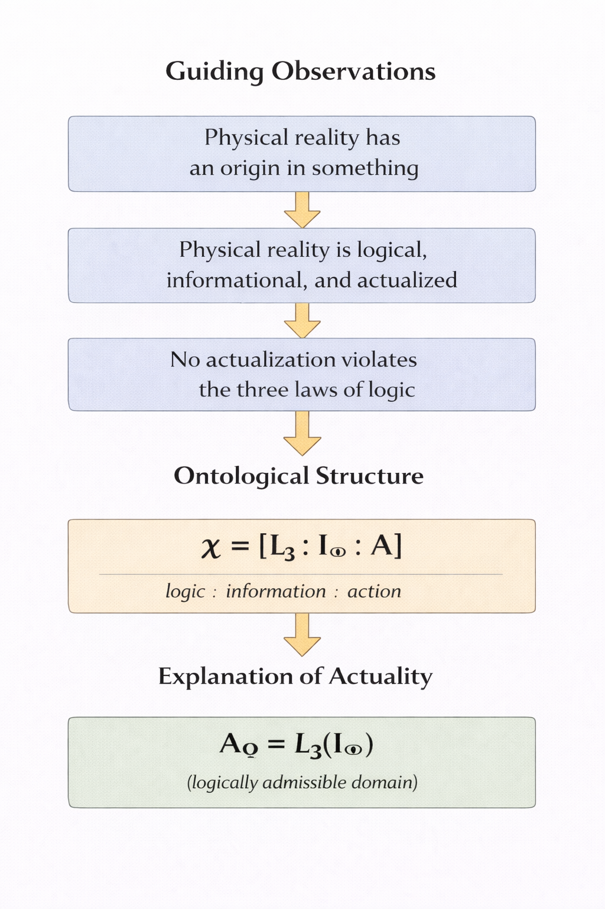
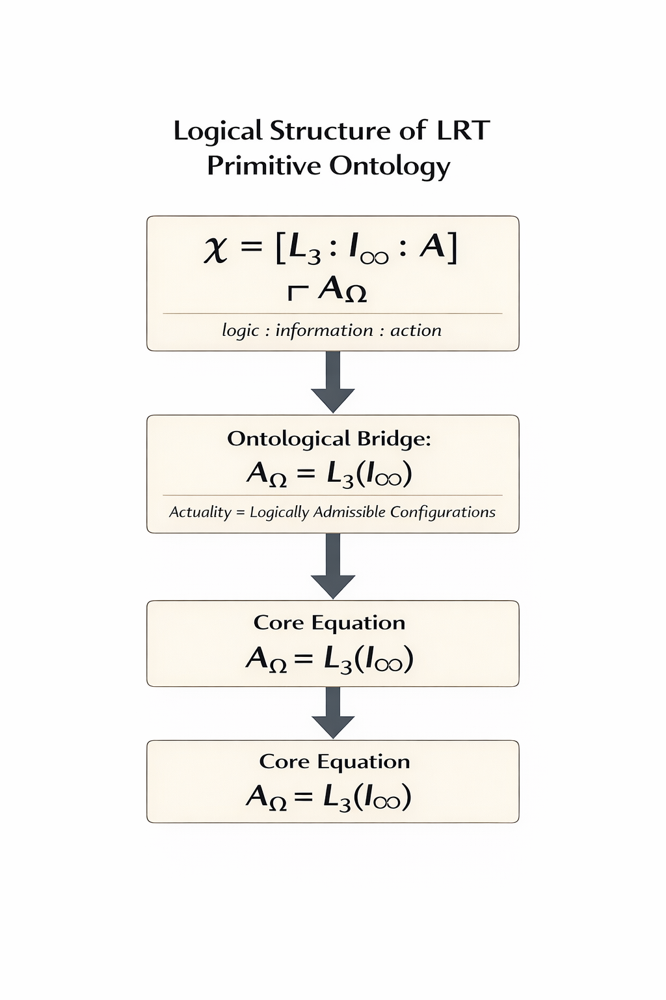

# The Actualization Bridge: Transcendental Foundations of Logic Realism Theory

## Part I: Ontological Groundwork

**James D. Longmire**
Northrop Grumman Fellow (unaffiliated research)
ORCID: 0009-0009-1383-7698

---

## Abstract

This paper establishes the minimal ontological structure required for anything to exist. Beginning from the impossibility of derivation from absolute nothing, we argue that three primitives are jointly necessary and sufficient for the constitution of reality: prescriptive logical constraint (L₃), infinite informational possibility (I∞), and actualization (A). These primitives are not postulated but transcendentally derived as conditions for the possibility of determinate existence. Their interaction yields the core physics bridge of Logic Realism Theory: actuality coincides with the logically admissible informational configurations of the total possibility space. This result, expressed as A_Ω = L₃(I∞), provides the ontological ground from which physical structure can subsequently be reconstructed. The present paper develops no new physical formalisms; instead, it secures the ontological framework intended to underwrite subsequent formal reconstruction of quantum and spacetime structure.

**Keywords:** logic, information ontology, metaphysics of reality, transcendental grounding

---

## 1. Three Guiding Observations

The present argument begins from three observations about the structure of physical reality. Figure 1 displays the complete grounding sequence from observations through primitives to core results.


*Figure 1: The complete grounding sequence. Guiding observations motivate the primitive ontology χ = [L₃ : I∞ : A], which grounds the actualized domain characterized by A_Ω = L₃(I∞).*

### 1.1 Physical Reality Has an Origin

Physical reality has an origin in something. The origin need not be temporal; it may be ontological. But the idea that the totality of what exists is simply brute and underived is unstable. Even the denial that reality has an origin presupposes some background structure in virtue of which the denial is meaningful.

This observation deepens into an impossibility argument. Absolute nothing (the complete absence of being, structure, constraint, and possibility) cannot generate or ground existence. This is not merely an empirical observation but a logical necessity: nothing has no properties, including the property of being able to produce something.

Attempts to derive existence from nothing face an immediate dilemma. Either "nothing" is truly absolute, in which case no derivation is possible, or "nothing" is qualified (a vacuum, a field, a potential), in which case something already exists and the question is merely pushed back.

The project of fundamental ontology therefore cannot begin with nothing. It must identify the minimal structure that is presupposed by any possible existence whatever. The question arises: what is the minimal "something" in virtue of which there is anything at all?

### 1.2 Physical Reality Is Logical, Informational, and Dynamic

Our physical theories presuppose logical constraint: certain configurations are excluded as impossible. They describe systems through structured distinctions (states, fields, amplitudes) which are naturally interpreted as informational. And they encode change: systems evolve, transition, and actualize states.

These features suggest that any adequate primitive ontology must include logical constraint, informational possibility, and a principle of actualization. The three features are not independent: logical constraint requires a domain to constrain, informational structure requires principles of coherence, and actualization requires both a space of candidates and criteria of admissibility.

### 1.3 No Actuality Violates the Fundamental Laws of Logic

Apparent anomalies in physics never license genuine contradiction. Superposition, contextuality, and nonlocal correlations challenge classical intuitions, but they do not instantiate violations of identity, non-contradiction, or excluded middle. The working assumption of physics is that whatever is physically actual must be logically admissible.

This is not merely a methodological convenience. It reflects a deeper structural fact: the actual domain is bounded by logical constraint. Nothing that violates the fundamental laws of logic can obtain. This observation will become the core of the bridge argument.

### 1.4 The Primitive Ontology and Two Core Results

The three observations motivate three primitives:

| Observation | Primitive |
|-------------|-----------|
| Reality has an origin | Ontological unity χ |
| Logical/informational/dynamic structure | L₃, I∞, A |
| No actuality violates logic | Bridge constraint |

The primitives form a co-constitutive unity:

$$\chi \equiv [L_3 : I_\infty : A]$$

The third observation yields the bridge equation: actuality coincides with the logically admissible configurations of the informational domain:

$$A_\Omega = L_3(I_\infty)$$

The remainder of this paper justifies these claims. Sections 2–4 establish that each primitive is transcendentally necessary. Section 5 demonstrates their mutual constitution. Section 6 derives the bridge identity. Section 7 situates TAB within information ontology and the Logic Realism tradition. Sections 8–9 draw consequences and conclude.

### 1.5 Method

Our approach is transcendental in the Kantian sense: we ask what conditions must obtain for any determinate existence to be possible. The answer is not empirical but necessary. We are not asking what exists but what must be the case for existence to be determinate rather than chaotic, structured rather than formless.

The criterion for success is not that we derive the furniture of the world from pure reason. The criterion is that we identify primitives that cannot be coherently denied without presupposing them. Any account of reality that purports to dispense with these primitives will, upon examination, depend upon them.

The method requires precision about what "necessity" means in this context. We are not claiming causal necessity (as if the primitives caused reality to exist) or modal necessity in the possible-worlds sense. We are claiming constitutive necessity: these primitives are what it is for anything to be determinately actual.

---

## 2. Necessity of Logical Constraint (L₃)

### 2.1 The Prescriptive Character of Logic

Logical constraint is not a description of how minds happen to think. It is a prescriptive structure governing what can and cannot obtain. The law of non-contradiction (a thing cannot both be and not be in the same respect at the same time) is not a psychological generalization but an ontological constraint.

This claim requires defense against two objections.

The first objection holds that logic is merely conventional—a set of rules we adopt for convenience but could in principle abandon. This objection fails because the attempt to articulate an alternative "logic" without non-contradiction is self-undermining. To assert that contradictions can obtain is already to invoke the contrast between assertion and denial, which presupposes the very structure being rejected.

The second objection holds that logic is descriptive of our cognitive limitations rather than prescriptive of being. This psychologizing move fails because it cannot account for the normative force of logical constraint. When we recognize that contradictions cannot obtain, we are not reporting a fact about our brains; we are grasping a constraint that would hold whether or not any minds existed.

### 2.2 From Inference to Ontology

A referee will rightly ask: why does the impossibility of *asserting* contradictions entail the impossibility of *ontological* contradiction? The bridge requires an additional step.

Determinate existence requires stable identity conditions. For something to be, it must be what it is and not something else. Contradictory states destroy identity conditions: if Px and not-Px hold simultaneously, x has no stable identity with respect to P. Such a state is not merely unthinkable; it is ontologically inadmissible. There is nothing for it to be.

The argument therefore runs:

1. Determinate existence requires stable identity conditions.
2. Contradictory states destroy identity conditions.
3. Therefore, contradictions cannot constitute determinate existence.

This step ties logical constraint directly to ontology rather than inference practice.

### 2.3 L₃ as Prescriptive Constraint Structure

We designate the prescriptive logical constraint structure as L₃, signifying its triadic character: identity, non-contradiction, and excluded middle. These are not separate principles but aspects of a unified constraint on determinate being.

- **Identity:** For any x, x = x. A thing is what it is.
- **Non-contradiction:** For any x and property P, not (Px and not-Px) in the same respect at the same time.
- **Excluded middle:** For any x and property P, either Px or not-Px.

These constraints are not merely logical in the sense of governing inference. They are ontological in the sense of governing existence. Nothing that violates them can obtain.

A clarification regarding logical systems: the argument does not depend on classical logic as a formal calculus. It depends on the minimal constraints required for determinate identity conditions. A paraconsistent logician might reject explosion (the principle that contradictions entail everything), but even paraconsistent systems typically preserve identity and some form of non-contradiction at the level of truth-values. The commitment here is ontological: any system allowing genuine contradiction—not merely formal inconsistency tolerance—would collapse the identity conditions required for determinate existence.

### 2.4 From Epistemic to Transcendental Necessity

A careful distinction is required here between two types of necessity:

- **Epistemic necessity:** We cannot coherently represent or reason about reality without presupposing L₃.
- **Transcendental necessity:** L₃ is required for the possibility of any determinate being whatsoever.

The arguments above establish epistemic necessity directly. The skeptic cannot formulate their skepticism without invoking what they deny. But does this entail transcendental necessity? Could reality itself violate L₃ even if we cannot represent that possibility?

The answer is no, and the reason goes beyond mere representational limits. The argument from §2.2 establishes that determinate existence requires stable identity conditions. Contradictions do not merely evade our representation; they fail to constitute anything at all. A putative state that is both P and not-P has no determinate identity with respect to P. There is nothing for such a state to be.

This is not a claim about the limits of thought but about the conditions for being. Epistemic necessity tracks transcendental necessity in this case because the very features that make L₃ indispensable for thought (the requirement of stable identity, the contrast between truth and falsity) are the same features required for determinate existence. The constraints are not parallel but identical: what cannot be coherently represented cannot obtain, not because representation limits reality, but because both representation and reality require the same structural conditions.

### 2.5 Engagement with Dialetheism

A sophisticated objection comes from dialetheist logicians (Priest 2006), who argue that some contradictions are true. If dialetheism is coherent, does it undermine the transcendental necessity of L₃?

The objection conflates two levels of analysis. Dialetheism concerns truth-value assignments to propositions: it holds that some propositions P are both true and false (truth-value gluts). This is a claim about the logical behavior of sentences in formal systems.

The TAB argument operates at a prior level: the conditions for determinate identity. For P to have any truth-value at all, there must be some fact of the matter about what P is about. P must have determinate content. But determinate content requires identity conditions: P is about this configuration rather than that one.

The dialetheist cannot reject identity at this level. To assert that "the liar sentence is both true and false" requires that the liar sentence be determinately the sentence it is. If the liar sentence lacked stable identity (if it were somehow both the liar sentence and not the liar sentence), there would be nothing for the truth-value glut to attach to.

Dialetheism therefore presupposes L₃ at the ontological level in order to operate at the propositional level. The dialetheist accepts identity conditions for sentences and meanings, then claims that some meaningful sentences have inconsistent truth-value assignments. This is logically possible. But it is not an objection to TAB, which concerns the conditions for anything to be determinately what it is in the first place.

A physical dialetheism, claiming that some configurations are ontologically both P and not-P, would destroy the identity conditions required for any truth-value assignment to make sense. Without identity, there is nothing to predicate of, and no proposition has content. This is not a restriction dialetheists accept; it is a condition they implicitly rely upon.

### 2.5 The Ontological Status of L₃

L₃ does not exist as a thing alongside other things. It is not an entity but a constraint on entities. Its mode of being is prescriptive: it determines what structures are admissible for any configuration that obtains.

The denial of L₃ is self-defeating. To deny that logical constraints govern being is to make an assertion that presupposes the contrast between truth and falsity, which is itself constituted by L₃. The skeptic about logic cannot formulate their skepticism without invoking what they deny.

L₃ is therefore transcendentally necessary. Any possible reality, any coherent account of existence, presupposes it.

---

## 3. Necessity of Informational Domain (I∞)

### 3.1 The Requirement of Differentiation

Existence is determinate existence. For anything to be actual, it must be this rather than that. Determinacy requires differentiation, and differentiation requires a domain of possible distinctions.

If there were only one undifferentiated plenum, with no internal structure or possible variation, there would be nothing to distinguish, nothing to select, and therefore nothing determinate. The very concept of actuality presupposes a background of possibility against which the actual stands out.

### 3.2 Information as Structured Distinction

We understand information in the fundamental sense as structured distinction. Information is not primarily about messages or signals (though these are derivative). It is about the possibility of distinguishing configurations.

An informational domain is a space of possible configurations that can be distinguished from one another. For reality to be determinate, such a domain is required.

A clarification is essential here. Information is not treated as a substance or physical medium. It is the formal characterization of distinguishability among configurations. Any relational structure capable of supporting determinate existence therefore instantiates informational structure. The informational domain is not an extra layer of reality but the minimal description of structured differentiation. A structural realist who prefers to speak of relations rather than information is welcome to do so—the argument requires only that some domain of distinguishable configurations exists, whatever terminology one employs.

### 3.3 I∞ as Total Possibility Space

We designate the total informational possibility space as I∞. The subscript signifies completeness rather than cardinality. This distinction matters: the argument does not claim that the possibility space is numerically infinite, but that it is complete with respect to possible distinctions.

The argument for completeness proceeds from closure rather than boundlessness:

1. Determinate actuality requires differentiation.
2. Differentiation presupposes a space of distinguishable configurations.
3. For any two configurations to be distinguishable, L₃ must permit their distinction.
4. I∞ is the space of all configurations whose mutual distinguishability is L₃-admissible.
5. Therefore, I∞ is complete as the closure of L₃-admissible differentiation.

This formulation avoids the geometric imagery of boundaries and larger spaces. Completeness is not spatial unboundedness but logical closure: I∞ contains all the distinctions that L₃ permits, and no distinctions that L₃ prohibits. A configuration "outside" I∞ would be a configuration that cannot be distinguished from others in an L₃-admissible way, which is to say, not a configuration at all.

I∞ is complete in the sense of exhausting the domain of possible configurations. Nothing outside I∞ can be actualized because there is nothing outside it to actualize. The completeness of I∞ is not an empirical claim but a conceptual requirement: it is the maximal set of mutually distinguishable configurations under L₃.

### 3.4 The Ontological Status of I∞

Like L₃, I∞ does not exist as a thing among things. It is the domain of possible configurations, not a configuration itself. Its mode of being is that of a possibility space: it is what is presupposed by any talk of determinate actuality.

The denial of I∞ would be the claim that actuality can occur without a domain of possibility. But this is incoherent. To say that something is actual is already to contrast it with what is merely possible, which presupposes the domain.

I∞ is therefore transcendentally necessary alongside L₃.

---

## 4. Necessity of Actualization (A)

### 4.1 The Gap Between Possibility and Actuality

L₃ and I∞ together provide logical constraint and a possibility space. But they do not yet account for actuality. Many configurations are logically consistent and informationally possible but do not obtain. Why these configurations rather than those?

The gap between possibility and actuality cannot be closed by adding more structure to the possibility space. No amount of description of what might be entails that anything is. Actuality is not a complex property reducible to possibility and constraint.

### 4.2 A as Primitive Marking

We designate the actualization primitive as A. Its role is to mark configurations as obtaining. This marking is not explanatorily further reducible.

To demand an explanation of why A marks some configurations rather than others is to misunderstand its status. A is not a mechanism that selects according to criteria; it is the primitive fact that some configurations obtain. The question "why these rather than those?" presupposes that there must be a prior principle determining A's operation. But A is the primitive; there is nothing prior.

A critical distinction: actualization is **ontologically primitive**, not **random**. Randomness is a positive characteristic—it presupposes a probability distribution governing outcomes. A has no such characteristic. It is not that A "randomly chooses" configurations; rather, A is the primitive marking of obtaining, prior to any selection mechanism. The distinction matters: randomness is a mode of selection, while A is the fact that selection occurs at all.

Primitive status does not imply arbitrariness. A primitive marks the point where explanatory regress terminates. The requirement that actuality be primitive follows from the impossibility of deriving existence from possibility alone. Any explanation of why A marks particular configurations would presuppose a further principle—and that principle would itself require either a primitive ground or an infinite regress. A is therefore logically unavoidable, not merely unexplained.

### 4.3 The Ontological Status of A

A is transcendentally necessary because without it, the gap between possibility and actuality cannot be bridged. L₃ constrains what can obtain. I∞ provides the domain of what might obtain. But neither makes anything actual. Actuality requires a primitive that is not reducible to constraint or possibility.

The denial of A would be the claim that possibility and constraint suffice for actuality. But this conflates the conditions for actuality with actuality itself. That a configuration is consistent and distinguishable does not make it actual. Something more is required, and that something is A.

### 4.4 A's Grounding Role and the Bridge Identity

A potential objection arises from the bridge identity derived below: if A_Ω = L₃(I∞), has A disappeared from the resulting ontology? Is it explanatorily idle?

The answer requires distinguishing two questions:

1. **What is the structure of the actualized domain?** The bridge identity answers: L₃(I∞). The structural profile of actuality coincides with the L₃-admissible configurations of I∞.

2. **Why is there an actualized domain at all?** A answers: because actualization is a primitive fact. Without A, there would be a space of admissible configurations with no fact of the matter about which obtain.

The bridge identity tells us what actuality looks like. A grounds the fact that there is actuality at all. These are different explanatory burdens. The laws of physics describe the structure of physical reality but do not explain why there is physical reality. Similarly, L₃(I∞) describes the structure of what obtains, while A grounds the obtaining itself.

A is therefore not rendered otiose by the bridge identity. The identity characterizes the domain that A constitutes. A's role is to ground the fact that some domain of configurations obtains; the identity specifies which domain that is, given the constraints.

### 4.5 Worked Example: Spin Measurement

To make A's role concrete, consider a spin-1/2 system before and during measurement.

**Before measurement:** The system is prepared in a superposition state, say $\lvert\psi\rangle = \alpha\lvert\uparrow\rangle + \beta\lvert\downarrow\rangle$. Within I∞, both $\lvert\uparrow\rangle$ and $\lvert\downarrow\rangle$ are L₃-admissible configurations. Each has determinate identity (spin-up is spin-up, not spin-down). The superposition is a representation of epistemic indeterminacy about which configuration will obtain when A operates; it is not an ontological contradiction.

**During measurement:** A marks one configuration as obtaining. The outcome is spin-up or spin-down, not both, and not neither. This is the primitive actualization event. There is no prior principle determining which outcome A selects; the selection is the primitive fact.

**What A does not do:** A does not explain why the probabilities are $\lvert\alpha\rvert^2$ and $\lvert\beta\rvert^2$. That is the province of the Born rule, derived elsewhere from Gleason's theorem and the structure of L₃(I∞). A does not explain why measurement interactions trigger actualization rather than continued superposition. That requires additional physical structure (the measurement postulate or a dynamical account).

**What A does do:** A grounds the fact that one outcome obtains. Without A, the system would remain in superposition indefinitely, and there would be no fact of the matter about outcomes. A is the primitive of obtaining, not the mechanism of selection.

This example illustrates the division of labor. L₃ excludes contradictory outcomes (spin-up and spin-down simultaneously). I∞ supplies the space of possible outcomes. A marks one as actual. The bridge identity, A_Ω = L₃(I∞), says that whatever A marks is an L₃-admissible configuration; it cannot be otherwise.

---

## 5. Interaction of the Primitives

### 5.1 The Primitive Ontology

We now have three primitives, each transcendentally necessary:

- **L₃:** Prescriptive logical constraint structure
- **I∞:** Total informational possibility space
- **A:** Actualization primitive

We designate their unity as χ:

$$\chi \equiv [L_3 : I_\infty : A]$$

The brackets indicate that these primitives are not merely conjoined but co-constitutive. Each requires the others for its full specification.

### 5.2 Mutual Dependence

L₃ without I∞ would be constraint on nothing—a structure with no domain to constrain. I∞ without L₃ would be an undifferentiated plenum with no internal structure—configurations would blur into one another without the possibility of distinction. A without both would have nothing to actualize and no principle distinguishing coherent from incoherent configurations.

The primitives therefore form a unity. They cannot be pried apart without rendering each incoherent.

### 5.3 Non-Redundancy of the Primitive Set

The mutual dependence argument establishes that the primitives require one another. A stronger claim is available: no proper subset of {L₃, I∞, A} suffices for determinate actuality.

Consider each pair:

1. **L₃ + I∞ without A:** Constraint and possibility space exist, but nothing obtains. The result is a static modal structure with no fact of the matter about actuality. This is the Tegmarkian scenario: all consistent mathematical structures "exist" but none is distinguished as actual.

2. **L₃ + A without I∞:** Constraint and actuality exist, but there is no domain of configurations for A to operate on. A marks something as obtaining, but "something" has no content. The result is actuality without differentiation—a single undifferentiated fact, not a structured world.

3. **I∞ + A without L₃:** Possibility space and actuality exist, but there is no constraint on what can obtain. A could mark contradictory configurations, destroying the identity conditions required for determinate existence. The result is not a coherent world but a chaos in which nothing is stably what it is.

Each pair fails in a distinct way. The triad is therefore irreducible: all three primitives are individually necessary, and no pair is jointly sufficient.

### 5.4 The Constitution of Actuality

The key question is: what does A produce when operating on I∞ under the constraints of L₃?

A cannot actualize configurations that violate L₃. Logical contradiction cannot obtain. This is not a limitation on A's "power" but a constitutive fact about what actuality is. An inconsistent state is not a state that could obtain but happens not to; it is not a candidate for obtaining at all.

A cannot actualize configurations outside I∞. There is nothing outside I∞ to actualize. I∞ exhausts the domain of possibility by definition.

A therefore operates within the space of logically admissible configurations of I∞. What A produces—the actual—is the result of actualization operating on possibility under constraint.

---

## 6. The Bridge Argument

### 6.1 The Grounding Sequence

We now present the core argument in three steps (see Figure 2).


*Figure 2: The equations-only view. Three observations motivate three primitives, yielding the primitive ontology and bridge identity.*

**Step 1: The Primitive Ontology**

$$\chi \equiv [L_3 : I_\infty : A]$$

This is not a postulate but the conclusion of Sections 2–4: these primitives are each transcendentally necessary, and they form a co-constitutive unity.

**Step 2: The Grounding Relation**

$$\chi \vdash A_\Omega$$

From the primitive ontology, actuality follows. The turnstile (⊢) signifies ontological grounding, not logical derivation in the narrow sense. Grounding here denotes constitutive dependence rather than logical inference. The claim is that actuality exists in virtue of the primitive ontology rather than being logically deduced from it.

A_Ω designates the actualized domain—the totality of what obtains. (The subscript Ω marks actualization throughout: configurations that are not merely possible but obtain.)

This step is secured by the argument of Section 4: A is the primitive of obtaining, and its operation on I∞ under L₃ constitutes actuality.

**Step 3: The Bridge Identity**

$$A_\Omega = L_3(I_\infty)$$

The actualized domain coincides with the logically admissible informational configurations of the total possibility space.

The identity arises from the operational interaction of the primitives. It is not stipulated that actuality equals L₃(I∞); rather, the structure of actuality is determined by the fact that actualization operates on the informational domain under logical constraint.

The argument proceeds in five steps:

1. A operates on I∞ (there is nothing outside I∞ for A to operate on).
2. L₃ constrains which configurations are admissible.
3. A can only actualize configurations admissible under L₃ (contradiction cannot obtain).
4. The set of L₃-admissible configurations of I∞ is denoted L₃(I∞).
5. Therefore, A_Ω = L₃(I∞).

The difference from a naive formulation is subtle but philosophically important: step 3 does not presuppose the conclusion but derives it from the constraint structure established in Section 2.

### 6.2 Status of the Bridge Equation

The bridge equation is an argued metaphysical identity. It is not:

- **A definition:** We are not stipulating that A_Ω means L₃(I∞). We are arguing that the structure of actuality, given the primitives, coincides with this characterization.
- **A formal theorem:** The argument is transcendental, not axiomatic. Formal verification can establish the internal consistency of the derivation chain, but the metaphysical warrant comes from the transcendental arguments of Sections 2–4.

The identity is derived, not stipulated, from the conjunction of three claims established above:

1. Only L₃-admissible configurations can obtain (§2).
2. I∞ exhausts the space of possible configurations (§3).
3. A operates over I∞ under L₃ constraint (§4–5).

Given (i)–(iii), the identity follows necessarily. There is no coherent way to hold the three premises while denying that A_Ω = L₃(I∞). The identity is substantive because its derivation depends on the transcendental arguments for each primitive; it would fail if any premise failed.

The notion of identity at stake is structural identity: A_Ω and L₃(I∞) pick out the same domain by different conceptual routes. A_Ω picks it out as "what obtains"; L₃(I∞) picks it out as "the admissible configurations of the possibility space." The claim is that these extensionally coincide, and that this coincidence is necessary given the primitives.

The bridge equation is the core result of this paper. Everything else in Logic Realism Theory—the reconstruction of quantum mechanics, the interpretational implications—flows from this ground.

---

## 7. Discussion: Locating TAB in Information Ontology and Logic Realism

The transcendental derivation of the Bridge Identity

$$A_\Omega \equiv L_3(I_\infty)$$

establishes a prescriptive floor beneath contemporary information-based ontologies of physics.[^1]

[^1]: Throughout §7, the triple bar (≡) marks metaphysical identity of domains, not stipulative definition. The claim is that A_Ω and L₃(I∞) pick out the same domain by different conceptual routes; the identity is derived from the primitives, not posited by fiat. Much recent work proposes that physical reality is informational or mathematical in character. These frameworks often identify informational structure as fundamental but leave unresolved a central question: under what condition does informational possibility become concrete physical actuality?

The TAB framework addresses this gap by identifying the minimal primitives required for determinate being and clarifying the structural relationship between logical constraint, informational possibility, and physical realization. This section situates TAB within the broader landscape of informational metaphysics while also locating it within the philosophical orientation sometimes described as **Logic Realism**, where logical structure is treated as ontologically prior rather than merely epistemic.

### 7.1 From "It from Bit" to Logical Actualization

John Archibald Wheeler's "It from Bit" proposal suggested that physical reality arises from binary informational distinctions (Wheeler 1990). Physical states correspond to answers to yes–no questions, and the structure of the universe reflects the accumulation of such informational choices.

The proposal captured an important insight but remained heuristic. Wheeler did not provide a formal account of the mechanism through which informational potential becomes determinate physical states.

Within TAB the distinction becomes explicit. Informational possibility is represented by the total informational domain I∞, the space of all structured distinctions. Physical actuality corresponds to the domain of configurations that obtain, A_Ω.

The transition between these domains is governed by the prescriptive constraint structure of the three fundamental laws of logic L₃. The Bridge Identity expresses the condition under which informational configurations qualify as actual:

$$A_\Omega \equiv L_3(I_\infty)$$

Physical reality therefore consists of the informational configurations that satisfy the minimal logical conditions required for determinate being. Informational structure supplies the possible configurations; logical admissibility determines which configurations can obtain.

In this way Wheeler's intuition receives a precise formulation. Informational possibility alone is insufficient for actuality. Logical constraint determines which informational configurations are capable of becoming real.

### 7.2 Static Plenums and the Role of Primitive Action

A different informational ontology appears in Max Tegmark's Mathematical Universe Hypothesis (MUH), which proposes that mathematical structure itself constitutes physical reality (Tegmark 2014). Within this framework every consistent mathematical structure exists. Possibility and actuality collapse into a single category.

TAB preserves a distinction between these domains. Logical syntax and informational structure provide the formal vocabulary of possible configurations, but possibility does not entail actuality. A further primitive is required to mark which configurations obtain.

TAB therefore introduces a primitive **actualization operator A**. This operator represents the irreducible marking of configurations as obtaining or not obtaining. Logical constraint determines admissibility, informational structure supplies the domain of possibilities, and primitive action performs the ongoing selection of actual states.

This preserves a central ontological distinction absent from purely mathematical ontologies:

$$\text{logical possibility} \neq \text{actuality}$$

Actuality emerges through the continuous operation of primitive action under logical constraint. Logical admissibility determines what can obtain; primitive action determines what does obtain.

### 7.3 Information as Transcendental Infrastructure

The informational domain invoked in TAB aligns with insights from Informational Structural Realism. Luciano Floridi characterizes information as structured distinction, a configuration in which differences are organized into meaningful relations (Floridi 2011).

TAB adopts this insight but grounds it transcendentally. Determinate existence requires distinguishability. For any entity to be this rather than that, a domain of possible distinctions must already exist. The informational domain I∞ therefore functions not as a physical medium but as the transcendental infrastructure of differentiation.

In this framework informational structure precedes any specific physical geometry. Geometry describes particular patterns within the informational domain once actualization occurs. The informational substrate therefore serves as a necessary condition for the intelligibility of physical reality rather than as a physical entity among others.

### 7.4 TAB within the Logic Realism Tradition

The ontological commitments of TAB also place it within a broader philosophical orientation sometimes described as **Logic Realism**, the view that logical structure is not merely descriptive of thought but prescriptive for being itself (Tahko 2014).

In many metaphysical frameworks the laws of logic function as rules governing reasoning about the world. Logic constrains inference but does not determine the structure of reality. Logic Realism reverses this priority. Logical principles express the minimal structural conditions required for anything to exist in a determinate way.

TAB develops this position formally. The three logical constraints L₃ are not treated as external rules imposed on an independently existing universe. They constitute the prescriptive conditions that any configuration must satisfy in order to obtain. Logical constraint therefore operates prior to both informational specification and physical instantiation.

Within this framework the informational domain I∞ represents the space of structured distinctions that logical constraint makes intelligible. The actualized domain A_Ω represents those configurations that satisfy the admissibility conditions determined by L₃. The Bridge Identity

$$A_\Omega \equiv L_3(I_\infty)$$

expresses this relationship directly. Logical structure determines the admissible informational configurations capable of appearing as physical reality.

This positioning clarifies the metaphysical orientation of TAB. The theory does not simply claim that reality is informational or mathematical. It advances the stronger thesis that logical structure is ontologically prior and that informational and physical structures arise within the domain that logical constraint permits.

### 7.5 The Ontological Hierarchy of LRT

The interaction of the primitives produces a hierarchical ontology that connects logical structure to physical realization.

1. **Logic (L₃)**
   The prescriptive constraint structure governing determinate being.

2. **Information (I∞)**
   The total domain of structured distinctions.

3. **Action (A)**
   The primitive operator marking configurations as obtaining.

4. **Actualized Domain (A_Ω)**
   The informational configurations satisfying logical admissibility.

5. **Geometry and Physics**
   The structured patterns that emerge within the actualized domain.

The Bridge Identity marks the critical transition within this hierarchy. Logical constraint applied to informational possibility yields the domain within which physical structures can appear.

### 7.6 Relation to Quantum Reconstruction Programs

Modern quantum reconstruction programs derive the formal structure of quantum theory from operational or informational principles (Hardy 2001; Chiribella, D'Ariano, and Perinotti 2011). These approaches demonstrate that quantum mechanics can be recovered from general axioms governing information processing.

TAB operates at a deeper ontological level. Rather than reconstructing quantum theory from informational axioms, it seeks to explain the metaphysical conditions that make informational structure itself possible. Logical constraint establishes the admissibility conditions for determinate configurations, while primitive action provides the mechanism through which informational possibility becomes actual physical structure.

From this perspective quantum reconstruction programs describe the geometric and probabilistic structures that arise within the already-actualized informational domain A_Ω. TAB therefore complements these approaches by supplying an ontological grounding for the informational principles they employ.

### 7.7 Contrast with Modal Realism

A natural question arises concerning the ontological status of non-actual configurations in I∞. If I∞ contains all L₃-admissible configurations, do the non-actualized ones "exist" in some robust sense?

TAB differs sharply from Lewisian modal realism, which treats non-actual possible worlds as concrete existents on par with our own. In TAB, non-actualized configurations in I∞ are structural possibilities, not concrete worlds. They are the configurations that L₃ permits and that A could mark as obtaining, but which lack the obtaining marker.

The asymmetry between actuality and mere possibility is ontologically fundamental. Actuality carries weight that possibility does not. The actualized domain A_Ω is not merely one region of I∞ among others; it is the domain constituted by A's operation. Configurations in I∞ \ A_Ω are not "elsewhere"; they simply do not obtain.

This preserves the modal distinction that Tegmark's MUH tends to efface while avoiding the inflationary metaphysics of concrete possible worlds. TAB is actualist about existence while realist about the structural space of possibilities.

---

This positioning clarifies the role of the Bridge Identity within contemporary metaphysics of physics. TAB does not merely assert that reality is informational or mathematical. It identifies the minimal transcendental structure required for informational possibility to become determinate physical actuality, situating the theory at the intersection of information ontology and the Logic Realism tradition.

---

## 8. Consequences for Ontology

### 8.1 What the Equation Claims

The bridge equation establishes that the structure of actuality is not arbitrary. Reality has a form: it is the logically admissible informational configurations of the total possibility space. This form is not imposed from outside but constituted by the interaction of the primitives.

This is a structural claim. It says nothing yet about the specific configurations that obtain, only that whatever obtains must have this form. The equation provides the framework within which physics operates, not the physics itself.

### 8.2 What the Equation Does Not Claim

The bridge equation does not claim:

- **That we can derive specific physical laws from pure reason.** Physics requires additional assumptions (empirical regularities, operational constraints) that are not contained in the primitive ontology. The reconstruction of quantum mechanics, presented elsewhere, proceeds by supplementing the foundation with such assumptions.
- **That the primitives are causally prior to the physical world.** The grounding relation is not temporal. The primitives do not exist "before" the physical world and then produce it. They are constitutively co-present with whatever exists.
- **That the bridge equation is empirically testable in isolation.** The equation is a framework, not a hypothesis. It becomes testable only when combined with specific physical claims.

### 8.3 The Scope of Transcendental Grounding

The transcendental arguments of this paper establish the form of any possible actuality. They do not establish the content. A skeptic might grant that L₃, I∞, and A are necessary and still ask: why is the physical world we observe selected from the space of possibilities?

This question is legitimate, but it is not answerable at the level of pure ontology. It requires engagement with the specific structure of physics. The bridge equation provides the starting point for that engagement; it does not complete it.

---

## 9. Conclusion

We have argued that three primitives—prescriptive logical constraint (L₃), total informational possibility (I∞), and actualization (A)—are each transcendentally necessary and jointly constitute the minimal ontology of reality. Their interaction yields the core physics bridge of Logic Realism Theory.

---

**Bridge Result**

$$\chi \equiv [L_3 : I_\infty : A]$$

$$\chi \vdash A_\Omega$$

$$A_\Omega = L_3(I_\infty)$$

---

Actuality coincides with the logically admissible informational configurations of the total possibility space.

This result provides the ontological foundation from which subsequent work can reconstruct physical structure. The reconstruction of quantum mechanics, presented in Part II, proceeds by supplementing this foundation with operational assumptions about the empirical regularities of the physical domain.

### 9.1 Outlook for Physics

The bridge identity constrains candidate physical theories in at least one concrete way: any physical structure must be realizable within A_Ω = L₃(I∞). This rules out physical theories that require ontological contradictions (states that are both P and not-P), configurations that cannot be distinguished from others (violations of identity), or structures that presuppose a possibility space narrower than L₃ permits without explanatory justification.

**A concrete example of a ruled-out ontology:** Paraconsistent Quantum Mechanics (PQM) programs (da Costa & de Ronde 2013) interpret quantum superposition as genuine ontological contradiction. On this view, when a system is in state $\lvert\psi\rangle = \alpha\lvert\uparrow\rangle + \beta\lvert\downarrow\rangle$, the system is literally both spin-up and spin-down. The superposition is not epistemic indeterminacy but ontological contradiction.

TAB rules this out. Superposition in the standard quantum formalism represents a configuration that is neither spin-up nor spin-down with respect to actualization; it is indeterminate, not contradictory. Indeterminacy is the absence of a fact; contradiction is the presence of incompatible facts. These are structurally different. An indeterminate configuration can be L₃-admissible (A has not yet operated with respect to the relevant property). A contradictory configuration cannot be L₃-admissible (it violates non-contradiction).

The PQM advocate might reply that paraconsistent logic permits localized contradiction without explosion. But the TAB objection is not about explosion; it is about identity. A system that is both P and not-P has no stable identity with respect to P. Without identity, there is nothing for measurement to determine, and no fact of the matter about outcomes. PQM's apparent solution to the measurement problem dissolves the very structure required to pose the problem.

More specifically, the framework motivates the informational axioms used in quantum reconstruction programs. The requirement that physical states be L₃-admissible configurations of I∞ suggests that state spaces must satisfy certain structural constraints (distinguishability, composition rules, update dynamics) that track the underlying logical admissibility conditions. Subsequent work develops these connections, deriving the Hilbert space formalism from the interaction of L₃ and I∞ under specific operational assumptions about measurement and preparation.

The bridge identity also bears on interpretive questions. If actuality coincides with L₃(I∞), then the measurement problem in quantum mechanics becomes a question about which configurations A marks as obtaining during measurement interactions, rather than a question about wave function collapse or branching worlds. This reframing may clarify the relationship between the quantum state and physical reality.

The bridge equation is not the end of the story but its beginning. Logic Realism Theory contends that the framework established here, when properly developed, yields a unique theory of physical reality. Whether that contention succeeds is a matter for subsequent investigation.

---

## Appendix A: Primitive Definitions

| Symbol | Name | Definition |
|--------|------|------------|
| L₃ | Prescriptive logical constraint structure | The triadic constraint of identity, non-contradiction, and excluded middle, understood as governing what can obtain, not merely what can be thought. |
| I∞ | Total informational possibility space | The complete domain of distinguishable configurations; exhausts the space of what might obtain. |
| A | Actualization primitive | The irreducible marking of configurations as obtaining; bridges possibility and actuality. |
| χ | Primitive ontology | The co-constitutive unity of L₃, I∞, and A: χ ≡ [L₃ : I∞ : A]. |
| A_Ω | Actualized domain | The totality of what obtains; the result of A operating on I∞ under L₃. |
| L₃(I∞) | Logically admissible configurations | The subset of I∞ consisting of configurations that satisfy L₃. |

---

## Appendix B: Logical Notation

| Symbol | Meaning |
|--------|---------|
| ≡ | Definitional equivalence |
| ⊢ | Ontological grounding (read: "grounds" or "constitutes") |
| χ | Chi; the primitive ontological unity |
| = | Identity |
| [A : B : C] | Co-constitutive unity of A, B, and C |
| ∞ (subscript) | Completeness; exhausting the domain |
| Ω (subscript) | Actualized; obtaining |

The turnstile (⊢) is adapted from its use in formal logic, where it signifies derivability. Here it signifies ontological grounding: χ ⊢ A_Ω means that the primitive ontology χ constitutes the actualized domain A_Ω. This is stronger than material implication and weaker than logical derivation in the technical sense.

---

## Appendix C: Formalization Status

The ontological framework presented in this paper has been partially formalized in Lean 4. The formalization project verifies the logical structure of the reconstruction chain that proceeds from the primitives established here. This appendix summarizes the boundary between transcendental argumentation and machine-verified derivation.

### What Is Formalized

The Lean formalization covers the physics reconstruction chain:

```
X → A_Ω → Determinate Identity → Local Tomography → ℂℋ →
PVM → Born Rule → Unitarity → Time → Schrödinger
```

Each step is implemented as a separate module with explicit dependencies. The current build (2026-03-20) compiles with zero errors and zero unresolved proof obligations.

### The Formalization Boundary

The transcendental arguments of Sections 2–4 are **not formalized**. No proof assistant can verify transcendental reasoning, which concerns the conditions for the possibility of determinate existence rather than logical derivability within a fixed formal system.

The formalization begins at the bridge principle, which appears as an axiom:

```lean
axiom bridge_principle (X : Step0.X) : Nonempty (A_Omega X)
```

This axiom corresponds to the result of Section 6: χ ⊢ A_Ω. The formalization takes this as given and verifies what follows.

### Axiom Classification

The formalization uses 31 axioms, classified as:

| Category | Count | Description |
|----------|-------|-------------|
| PRIMITIVE | 3 | Ontological commitments (I, I_infinite, bridge_principle) |
| EXTERNAL | 14 | Established mathematics (Gleason, Stone, Hardy, etc.) |
| REMAINING | 14 | Derivable with additional infrastructure |

The primitive axioms correspond to the transcendental necessities argued in this paper. External axioms are standard mathematical results imported rather than re-proven. Remaining axioms are derivation targets for ongoing work.

### Verification Instructions

The formalization is available in the repository `formalization/`. Build commands:

```bash
cd formalization && ./scripts/build.sh
```

See `theory/LRT-Formalization-Methods.md` for detailed documentation.

### Significance

The formalization demonstrates that the physics reconstruction (Part II) is internally consistent given the ontological foundation (Part I). It does not mechanize the transcendental arguments themselves. The combination of philosophical argumentation and formal verification is the methodological innovation of Logic Realism Theory.

---

## References

**Chiribella, G., D'Ariano, G. M., & Perinotti, P.** (2011). Informational derivation of quantum theory. *Physical Review A*, 84(1), 012311. https://doi.org/10.1103/PhysRevA.84.012311

**da Costa, N. C. A., & de Ronde, C.** (2013). The paraconsistent logic of quantum superpositions. *Foundations of Physics*, 43(7), 845–858. https://doi.org/10.1007/s10701-013-9721-9

**Floridi, L.** (2011). *The Philosophy of Information*. Oxford University Press. https://doi.org/10.1093/acprof:oso/9780199232383.001.0001

**Hardy, L.** (2001). Quantum theory from five reasonable axioms. *arXiv preprint quant-ph/0101012*. https://arxiv.org/abs/quant-ph/0101012

**Priest, G.** (2006). *In Contradiction: A Study of the Transconsistent* (2nd ed.). Oxford University Press. https://doi.org/10.1093/acprof:oso/9780199263301.001.0001

**Tahko, T. E.** (2014). The metaphysics of logic. In P. Rush (Ed.), *The Metaphysics of Logic* (pp. 1–17). Cambridge University Press.

**Tegmark, M.** (2014). *Our Mathematical Universe: My Quest for the Ultimate Nature of Reality*. Knopf.

**Wheeler, J. A.** (1990). Information, physics, quantum: The search for links. In W. H. Zurek (Ed.), *Complexity, Entropy, and the Physics of Information* (pp. 3–28). Addison-Wesley.

---

*End of document.*
